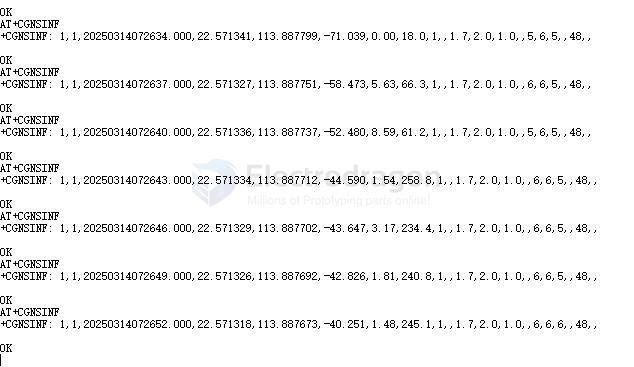

# SIMCOM AT GNSS

### AT+SGNSCMD=1,0

### AT+SGNSCFG

    AT+SGNSCFG="NMEAOUTPORT",1 //Configure GNSS out to USB NMEA port before
    GNSS power on

    AT+SGNSCFG="NMEAOUTPORT",2

### from Modem Side 

    AT+CGNSPWR=1
    AT+CGNSINF

result

    //Example of Open GNSS.
    AT+CGNSPWR=1 //Turn on GNSS power(UART or USB AT port)
    OK
    AT+CGNSINF //Read GNSS navigation information
    +CGNSINF: 1,1,20191024051848.000,31.221946,121.355565,3.417,0.00,,0,,1.4,1.7,0.9,,6,,12.4,12.0
    OK

result shift from time verified to location verified

    OK
    AT+CGNSINF
    +CGNSINF: 1,,20230315095031.434,0.000000,0.000000,-18.000,,,1,,0.1,0.1,0.1,,,,9999000.0,6000.0

    OK
    AT+CGNSINF
    +CGNSINF: 1,,20230315095032.155,22.571717,113.887426,10.487,1.07,,1,,1.4,3.6,3.3,,4,,142.8,270.0

my location: 22.571717,113.887426

    AT+CGNSSPWR=1
    AT+CGNSSTST=1
    AT+CGPSINFO=1

## SIM868 

## ref 

- [[SIMCOM-at-dat]]