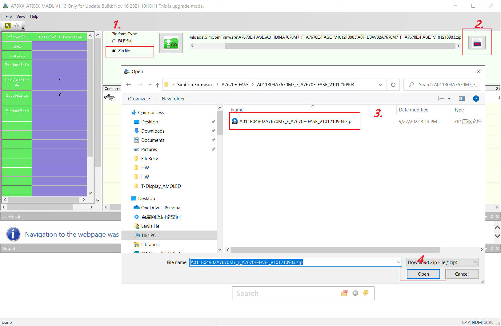
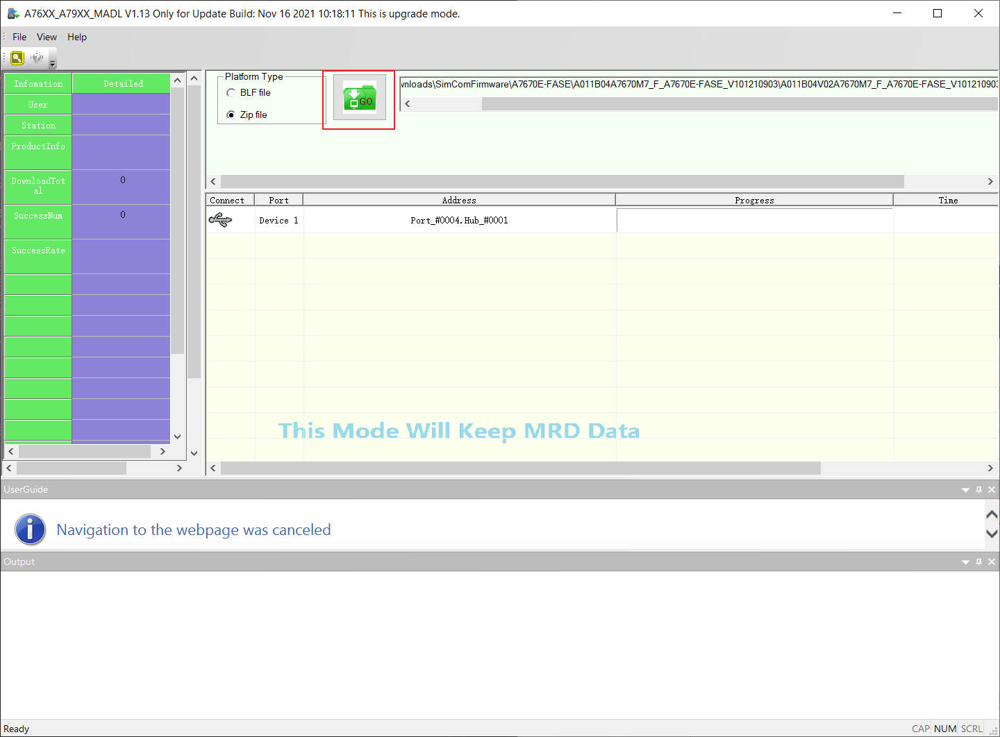

## SIMCOM-SDK-dat

Before upgrading, please send "AT+SIMCOMATI" to check the hardware version. 

If the wrong version of firmware is written, the modem may be damaged.

    AT+SIMCOMATI
    Manufacturer: INCORPORATED
    Model: A7670SA-FASE
    Revision: A011B07A7670M7_F
    A7670M7_B07V01_240927
    QCN:
    IMEI: 862092069763823
    MEID:
    +GCAP: +CGSM,+FCLASS,+DS
    DeviceInfo:

    OK

== A011B07 A7670 M7_F

## CatStudio

[Flash tools - A76XX_A79XX_MADL V1.32 Only for Update.zip](https://drive.google.com/file/d/12nt5-wcsUT6bRaEhfOMBSq0EhOl8R2by/view)

[A7670SA-FASE GPS](https://drive.google.com/file/d/1-CcYlyPOYpIpcmSDjnfIXDE-GuazzLjO/view?usp=sharing)

## A76XX_A79XX_MADL V1.32 Only for Update Build: Jun 11 2024 09:26:31 This is upgrade mode.

Open A76XX_A79XX_MADL V1.13 Only for Update.exe

Choose to upgrade the firmware according to the steps in the figure below

Click GO Button , Wait for the progress bar to complete.

Note: **click the GO, then plug in the board**

## ref

- https://github.com/Edragon/SIMCOM_upgrade

- [[A76XX_A79XX_Series_Upgrade_User_Guide.pdf]]
 
- [[driver-dat]]

- [[SIMCOM]]