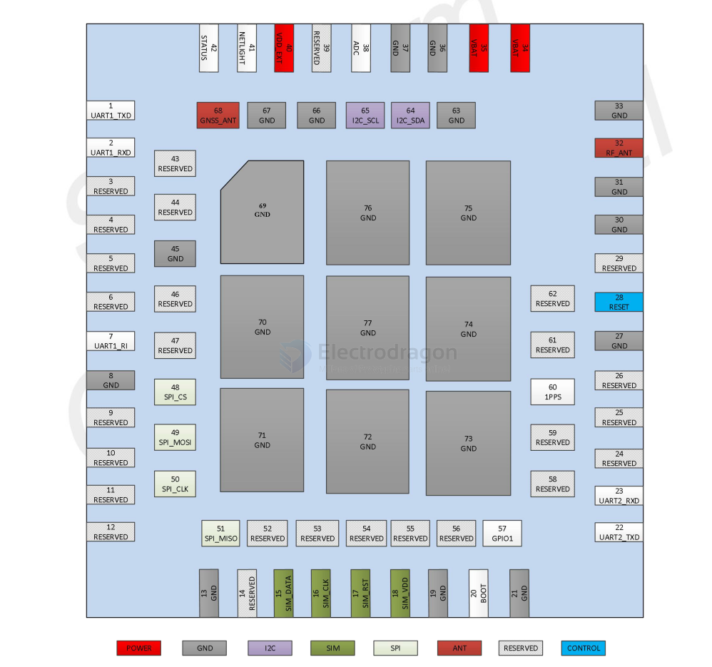
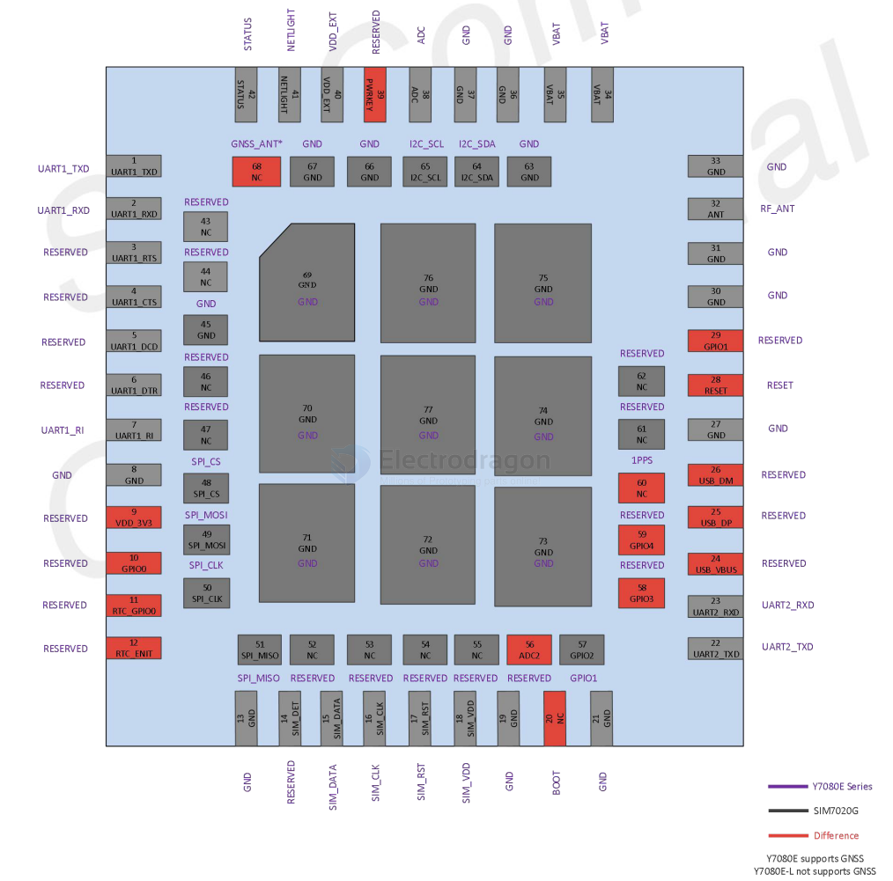

# Y7080E-dat

## Pin map 

## comparison 

| Specs         | SIM868     | Y7080E                                      |
| ------------- | ---------- | ------------------------------------------- |
| Power Supply  | 3.4V ~4.4V | 3.0V～4.2V. Default :3.3V                   |
| Power Saving  | -          | PSM mode: 1.7uA @3.6V                       |
| Network Power | -          | LTE CAT NB2                                 |
| GNSS          |            | GNSS engine (GPS, GLONASS, BD and Galileo). |

I VBAT(peak) 
- Module power peak current in NB-IoT and GNSS cooperative working mode. 
- 0.5 A

## Pin 

| Pin No. | Pin Name  | Pin No. | Pin Name  | Pin No. | Pin Name |
| ------- | --------- | ------- | --------- | ------- | -------- |
| 1       | UART1_TXD | 2       | UART1_RXD | 3       | x        |
| 4       | x         | 5       | x         | 6       | x        |
| 7       | UART1_RI  | 8       | GND       | 9       | x        |
| 10      | x         | 11      | x         | 12      | x        |
| 13      | GND       | 14      | x         | 15      | SIM_DATA |
| 16      | SIM_CLK   | 17      | SIM_RST   | 18      | SIM_VDD  |
| 19      | GND       | 20      | BOOT      | 21      | GND      |
| 22      | UART2_TXD | 23      | UART2_RXD | 24      | x        |
| 25      | x         | 26      | x         | 27      | GND      |
| 28      | RESET     | 29      | x         | 30      | GND      |
| 31      | GND       | 32      | RF_ANT    | 33      | GND      |
| 34      | VBAT      | 35      | VBAT      | 36      | GND      |
| 37      | GND       | 38      | ADC       | 39      | x        |
| 40      | VDD_EXT   | 41      | NETLIGHT  | 42      | STATUS   |
| 43      | x         | 44      | x         | 45      | GND      |
| 46      | x         | 47      | x         | 48      | SPI_CS   |
| 49      | SPI_MOSI  | 50      | SPI_CLK   | 51      | SPI_MISO |
| 52      | x         | 53      | x         | 54      | x        |
| 55      | x         | 56      | x         | 57      | GPIO1    |
| 58      | x         | 59      | x         | 60      | 1PPS     |
| 61      | x         | 62      | x         | 63      | GND      |
| 64      | I2C_SDA   | 65      | I2C_SCL   | 66      | GND      |
| 67      | GND       | 68      | GNSS_ANT  | 69      | GND      |
| 70      | GND       | 71      | GND       | 72      | GND      |
| 73      | GND       | 74      | GND       | 75      | GND      |
| 76      | GND       | 77      | GND       |

- x = reserved 

## test AT commands 

for testing 

    +CGEV:ME PDN ACT 0
    +CTZEU:+32,0,2024/07/14,09:56:56

    AT+COPS?
    +COPS:0,2,"46000",9

    AT+CGNSSTST=1
    AT+CGNSSPWR=1

## ref 

- [[TPS62088-dat]] - [[TI-power-dat]]

- [[GPS-antenna-design-dat]] - [[antenna]] - [[antenna-design-dat]] - [[antenna-dat]]

- [[reset-dat]] - [[status-dat]] - [[indicator-dat]] - [[dcdc-boost-dat]]

- [[I2C-dat]] - [[SPI-dat]]
  
- [[Y7080]]

- [[SIMCOM-dat]]

+POWERON:0

^SIMST:0
