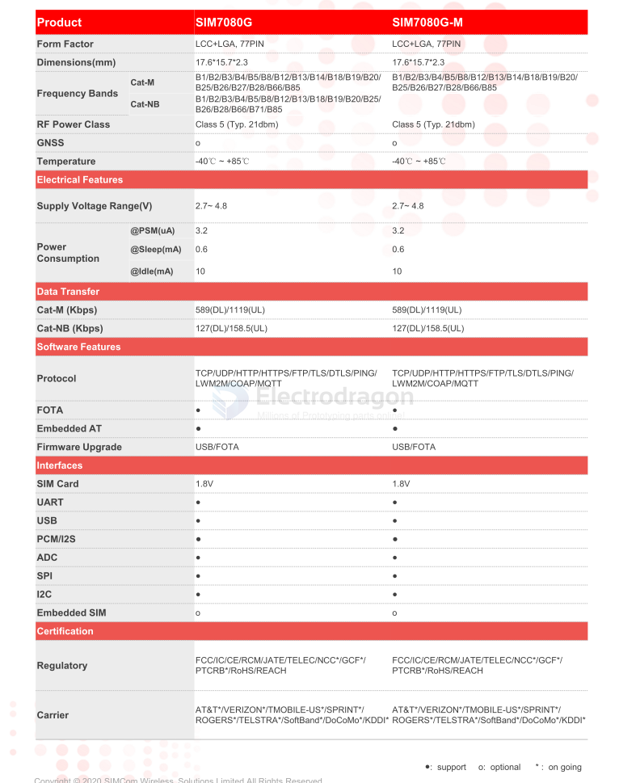

# SIM7080-dat

## Specs 

The SIM7080 series is the LPWA module which supports wireless communication modes of Cat-M/Cat-NB. 
 
The SIM7080 series adopts LCC and LGA form factor and has a compact size of 17.6mm*15.7mm which makes it ideal for compact products design. 
 
The SIM7080 series has powerful expansibility with abundant interfaces including UART, GPIO, PCM, SPI, I2C etc. 

The SIM7080 series is designed for applications that need low latency, low throughput data communication in a variety of radio propagation conditions. 

Due to the unique combination of performance, security and flexibility, this module is ideally suited for M2M applications, such as metering, asset tracking, remote monitoring, E-health etc. 

## Boards 

- [[NGS1128-dat]]

new version
- [[NGS1129-dat]]

