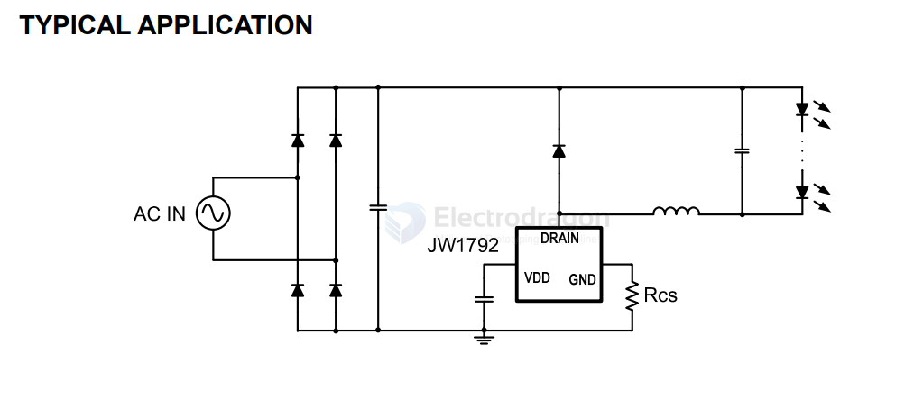

# JW1792-dat.md

- [[JW1792-dat]] - [[SPmicro-dat]] - [[led-driver-dat]] - [[moc3063-dat]]

Integrated 500V MOS Non-isolated Buck LED Driver

http://www.spmicro.com.cn/uploads/xiazai/SP-JW1792.pdf

JW1792 is a non-isolated, constant output current step-down LED driver with 500V MOSFET integrated. Operating in the boundary mode makes it high efficiency and low radiation. Patented algorithms ensure good current accuracy and excellent line/load regulations with lowest BOM cost.

JW1792 is supplied from the MOSFET drain directly, so the auxiliary winding is eliminated, which can light up the LED within 100mS. With unique sampling techniques, JW1792 has multi-protection functions which can largely enhance the safety and reliability of the system, including VDD UVLO, inductor short protection, LED short protection and over-temperature protection. 

## ref 