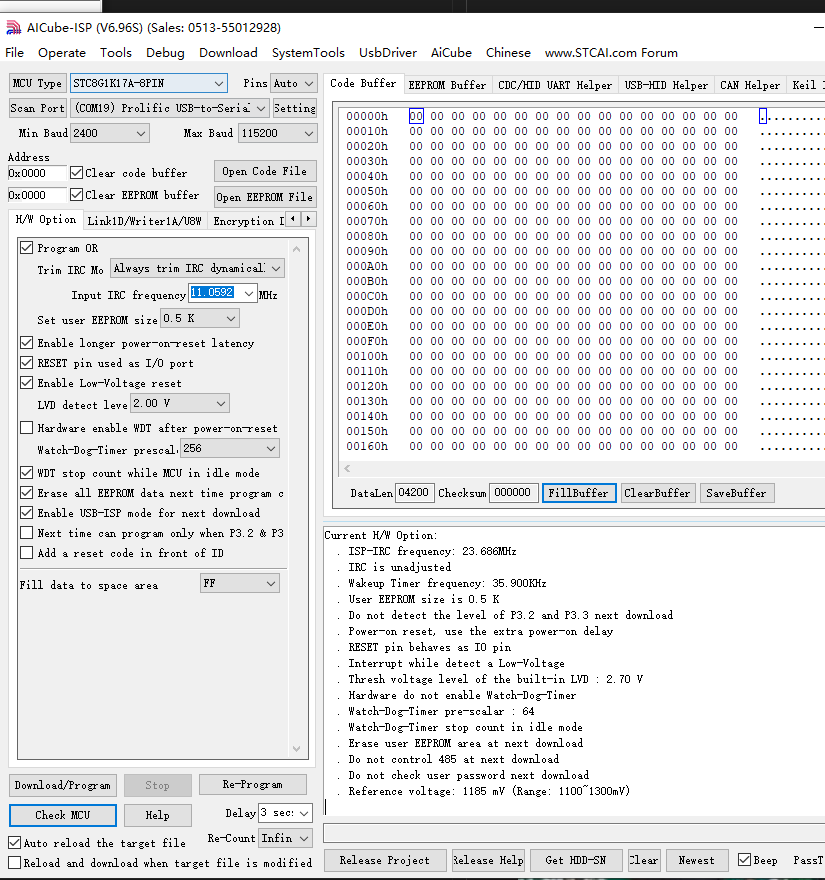
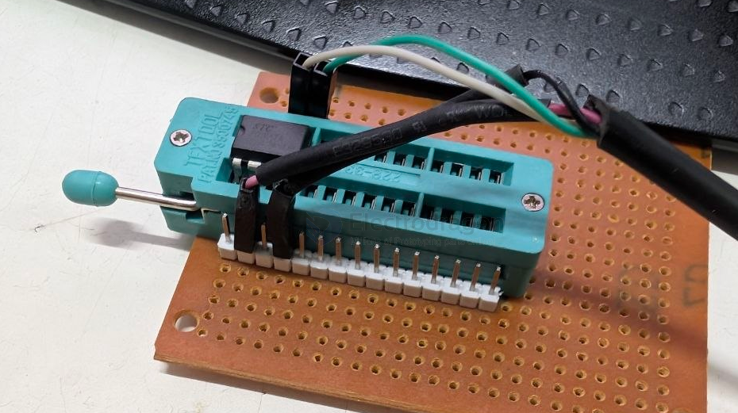

# STC-SOP8-dat

- [[STC-SOP8-dat]] - [[STC-dat]]

- [[DIP8-dat]] - [[SOP8-dat]] - [[PCB-footprint-dat]] - [[PCB-dat]]

## STC8H / STC8G 

STC8G1K17A

STC8H1K08-36I-QFN20 Enhanced 1T 8051 Microcontroller (MCU)

STC8G1K08A-36I-DFN8

SOP8 - 8G1K08 - [[sensor-lidar-dat]]

[[serial-dat]] interface 

## pin definitions 

## board 

## flash 

- [[programmer-socket-dat]]

## ref 

