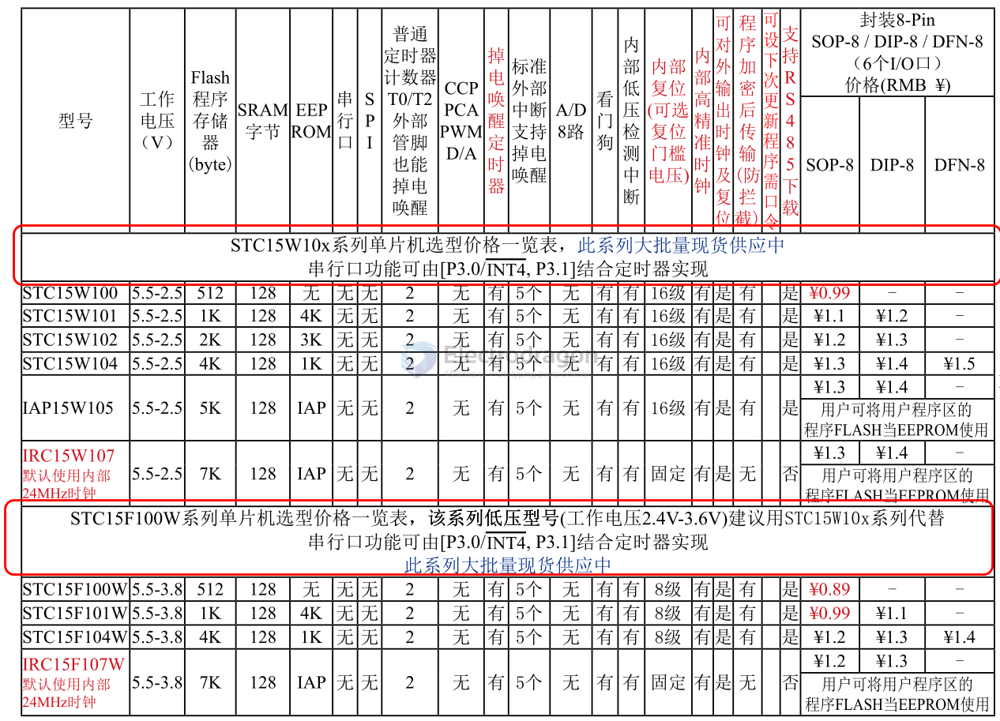
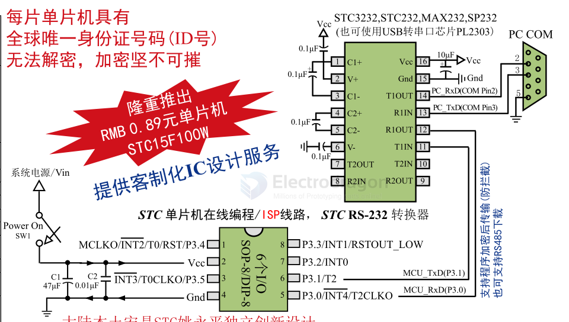
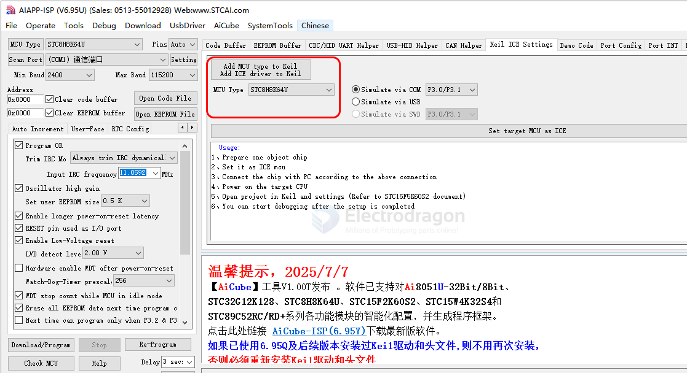

# STC-dat.md

- [[CIC1057-dat]] - STC15F104W SOP-8 MCU == 1.2.STC15F100W系列单片机总体介绍(B版大批量现货供应中)

STC8G1K08A-36I-DFN8

## STC12 

STK12C68
STK12C68
STK12C68

## STC15 

- [[STC-STC15.pdf]] (very large file, better download to view)

### STC15W100, STC15F100 series 

## APP 

- [[SCU1047-dat]]

## repo 

- https://github.com/Edragon/STC

## SDK 

STC ISP programming software (v6.95U)

install keil header files 

- [[Keil-C51-dat]] 

## ref 

- [[MCU-dat]]