# STC-dat.md

- [[CIC1057-dat]] - STC15F104W SOP-8 MCU == 1.2.STC15F100W系列单片机总体介绍(B版大批量现货供应中)

## STC12 

STK12C68
STK12C68
STK12C68

## STC15 

- [[STC-STC15.pdf]] (very large file, better download to view)

### STC15W100, STC15F100 series 

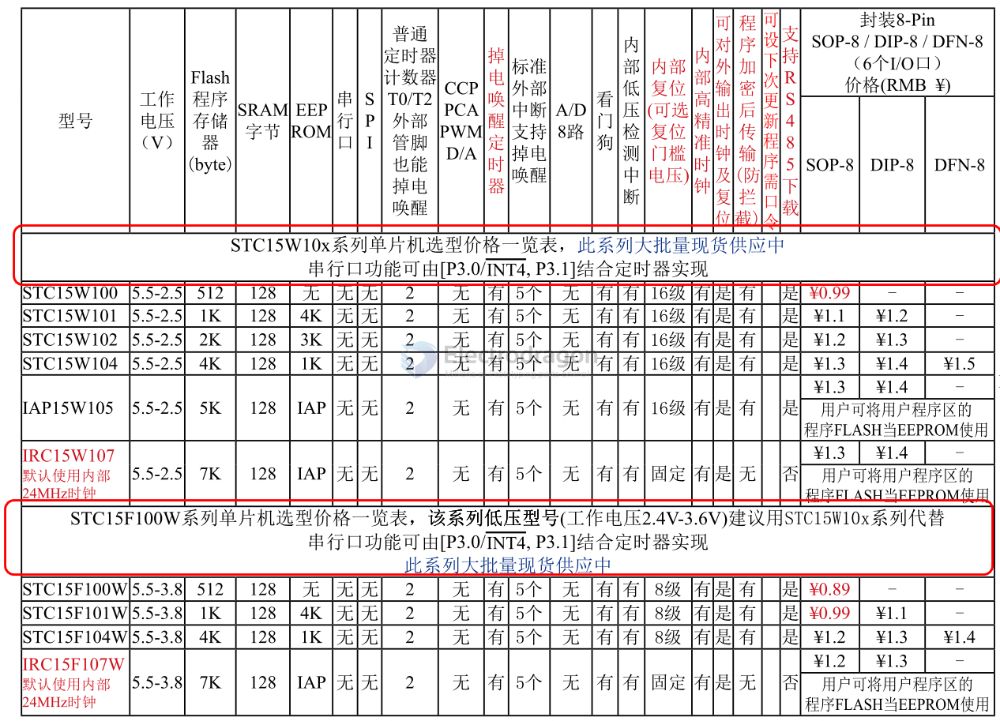

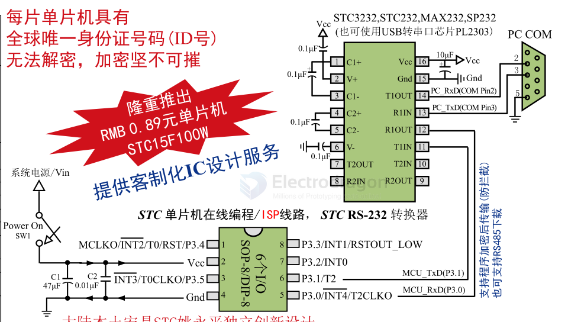

## STC8H / STC8G 

STC8H1K08-36I-QFN20 Enhanced 1T 8051 Microcontroller (MCU)

STC8G1K08A-36I-DFN8

SOP8 - 8G1K08 - [[sensor-lidar-dat]]

[[serial-dat]] interface 

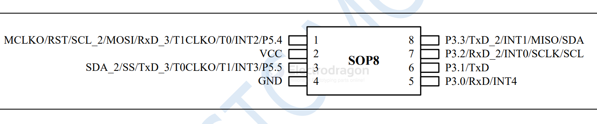

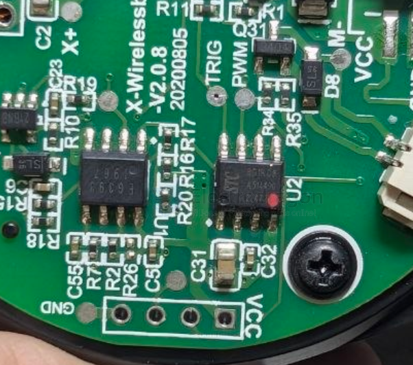

产品详情：

STC8H系列单片机是不需要外部品振和外部复位的单片机，是以超强抗干扰／超低价／高速／低功耗为目标的8051单片机，在相同的工作频率下，STC8H系列单片机比传统的8051约快12倍（速度快11.2~13.2倍），依次按顺序执行完全部的111条指令，STC8H系列单片机仅147个时钟，而传统8051则需要1944个时钟。STC8H系列单片机是STC生产的单时钟/机器周期（1T）的单片机，是宽电压/高速/高可靠低功耗/较强抗干扰的新一代8051单片机，超级加密。指令代码完全兼容传统8051

内核：
- 1.超高速32位.8051内核（1T），比传统8051约快70倍以上
- 2.49个中断源，4级中断优先级
- 3.支持在线仿真

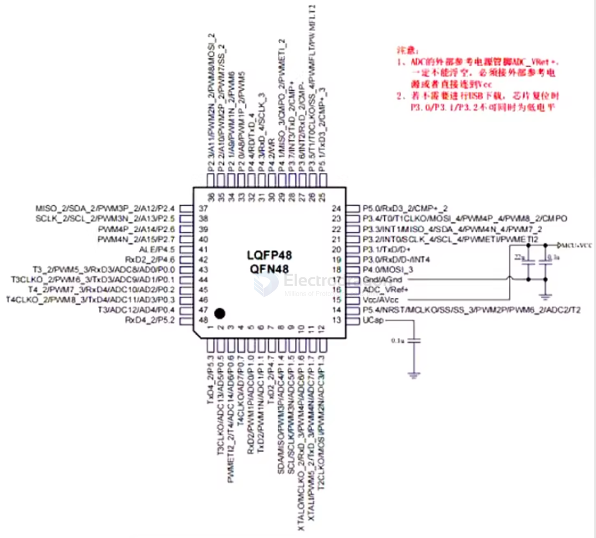

SCH 

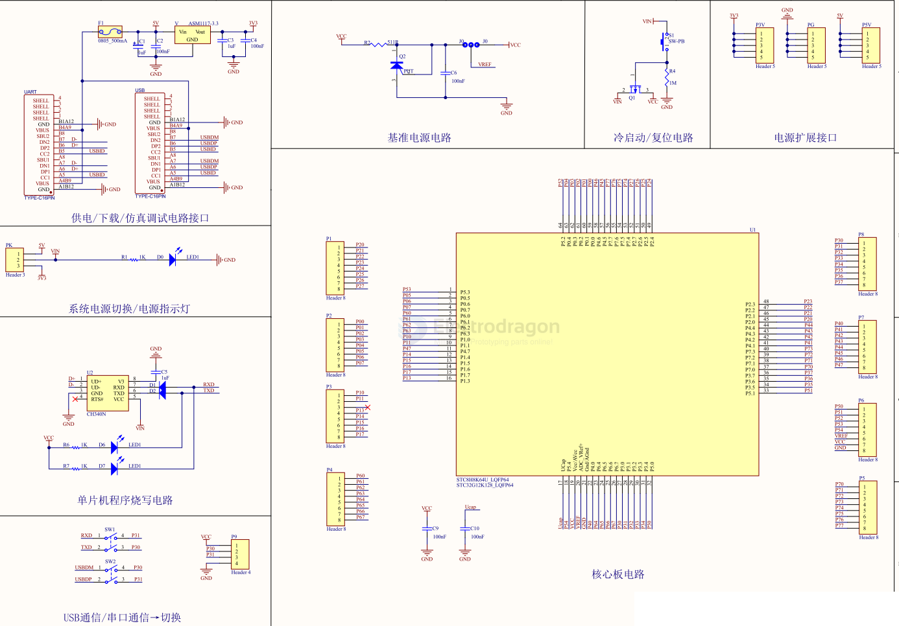

SCH 2 

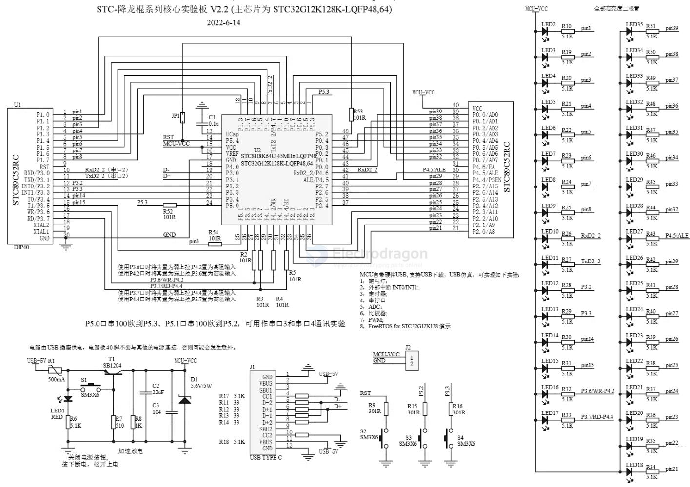

SCH 3 == 2UART - [[serial-dat]] - [[STC-dat]]

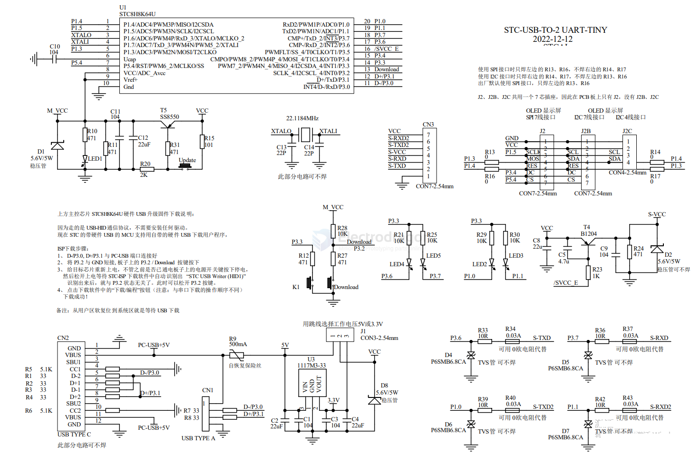

SCH 4 == [[CAN-dat]] - [[PWM-dat]] - [[DAC-dat]] - [[STC-dat]]

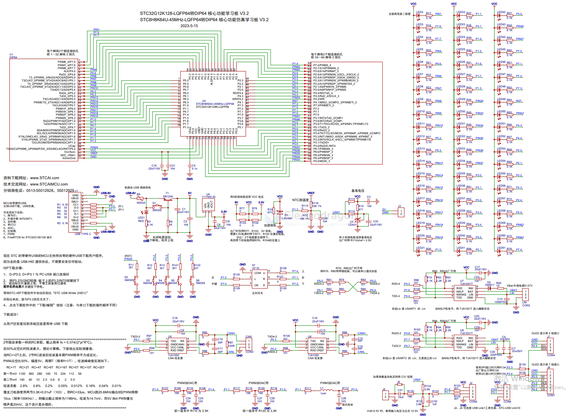

SCH 5 == [[Oscilloscope-dat]] - [[display-dat]]

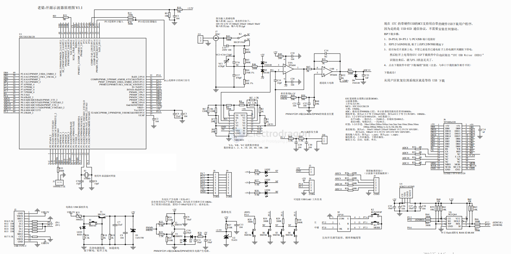

SCH 6 == [[touch-dat]]

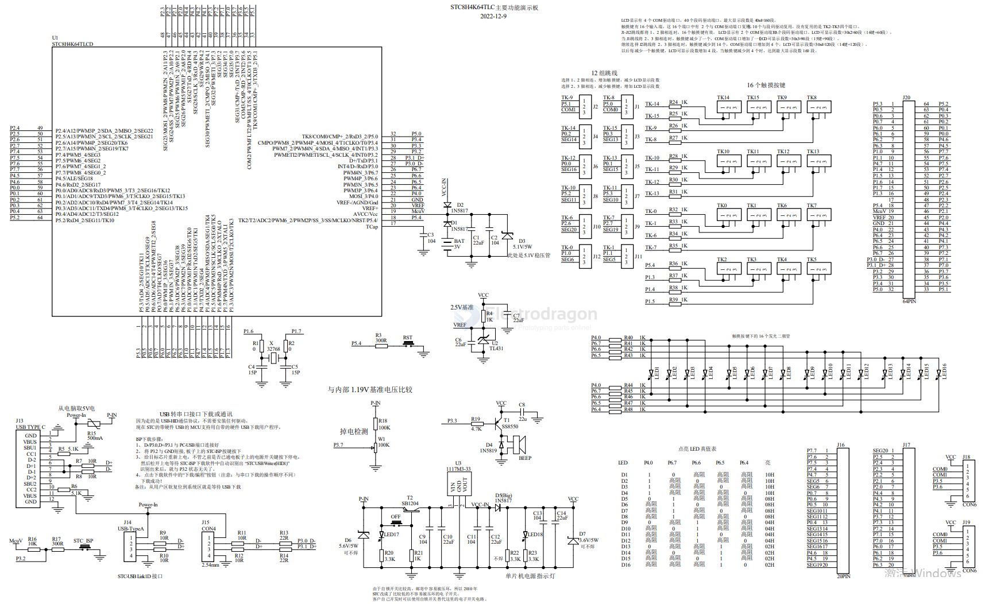

## APP 

- [[SCU1047-dat]]

## repo 

- https://github.com/Edragon/STC

## SDK 

STC ISP programming software (v6.95U)

install keil header files 

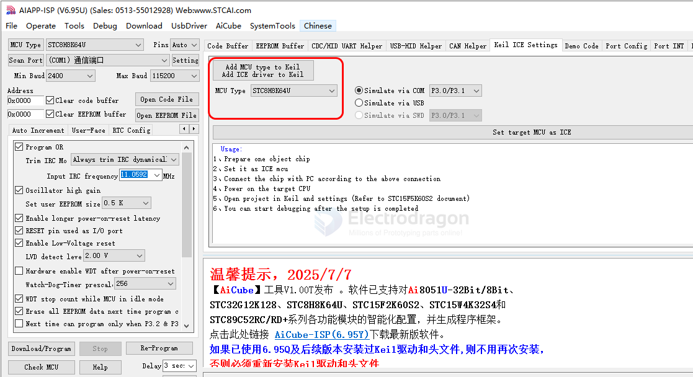

- [[Keil-C51-dat]] 

## program 

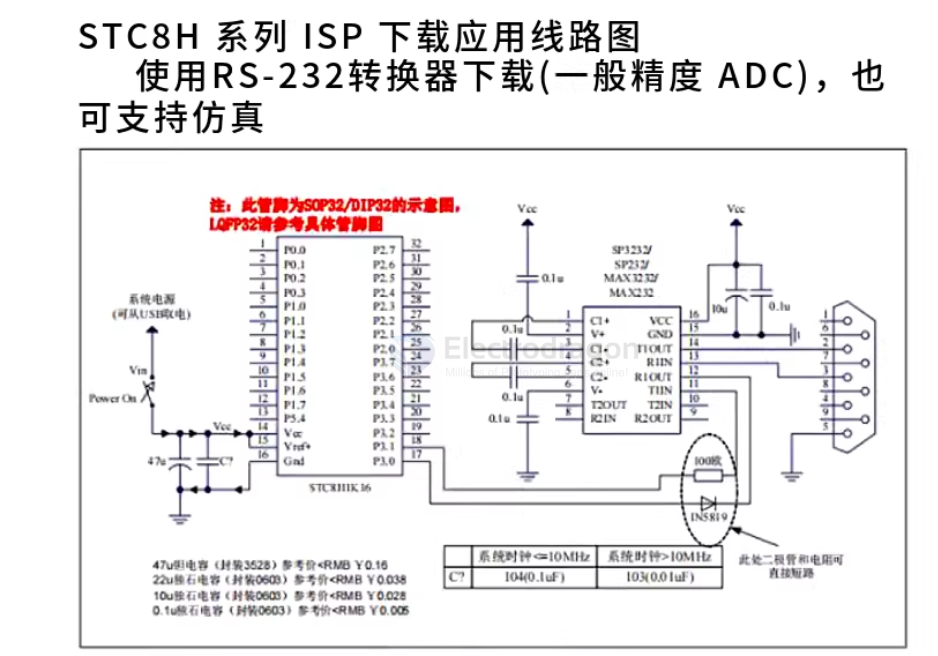

ISP下载步骤： - [[ISP-dat]]
- 1.给目标芯片停电
- 2.点击STC-ISP下载软件中“下载/编程”按钮
- 3.给目标芯片上电
- 4.开始ISP 下载

## ref 

- [[MCU-dat]]