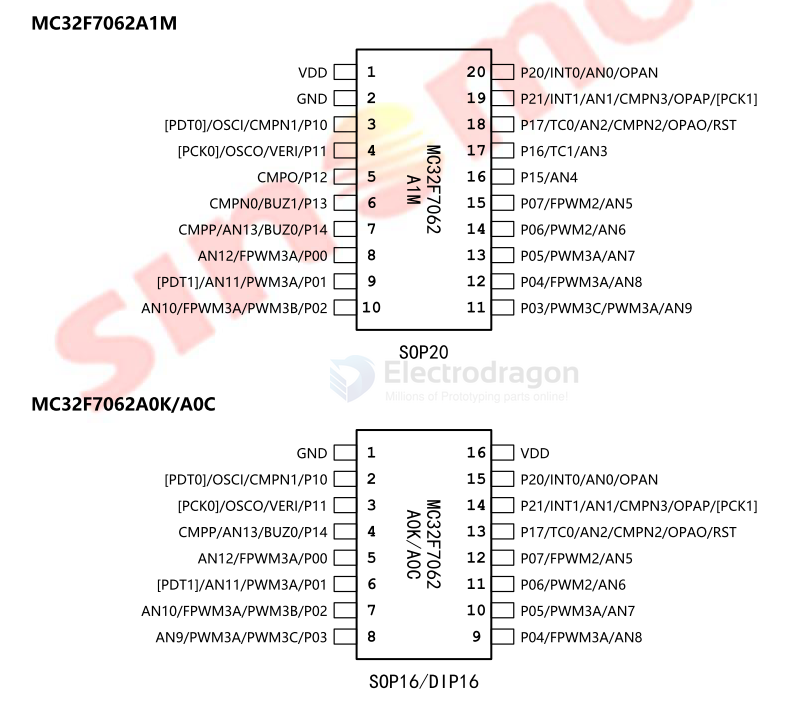

# SinoMCU-dat

MC32F7062

The MC32F7062 (often labeled MC32F7062A0K) is a highly integrated 8-bit RISC microcontroller developed by SinoMCU (晟矽微电). It is widely used in smart appliances, industrial controls, and battery-powered wearables due to its cost-efficiency, low power consumption, and robust noise immunity.

- [[MCU-dat]] 

datasheet == [[MC32F7062-datasheet.pdf]]

## ref 