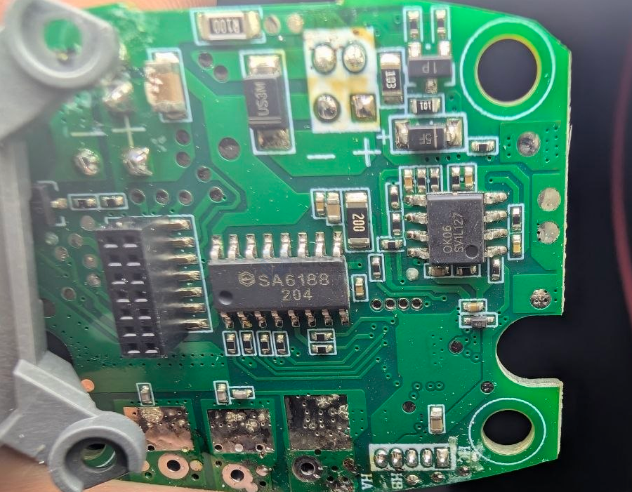
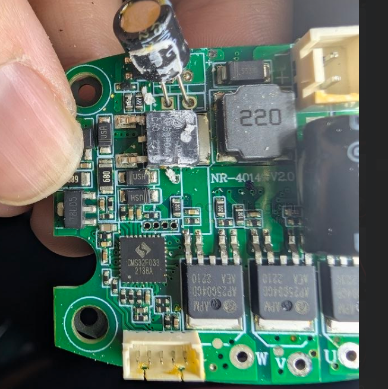

# Sytatek-dat

- [[Sytatek-dat]] - [[belling-dat]] - [[HDSC-dat]]

- [[Sytatek-dat]] - [[SA6188-dat]] - [[SA6128-dat]] - [[motor-brushless-dat]] - [[motor-driver-BLDC-dat]] - [[motor-driver-dat]]

## SA6188 

55V Three-phase P+N Driver | SA6188 Integrated LDO 300mA/80mA Drive Capability, Supports Enable Control, ESOP16/TSSOP20 Package! 

【SA6188 Three-phase P+N Gate Driver Chip】

55V Withstand Voltage, Integrated 5V/50mA LDO, Supports PMOS+NMOS Drive Architecture!

📦 Brand: #Sytatek# #矽塔科技#

🔖 Model: #SA6188# (Multi-version Optional: C/S/E/T)

📐 Package: #ESOP16# / #SOP16# / #CPC16# / #TSSOP20#

⚡ Core Features

• Power Supply Withstand Voltage: 5.0V – 55V (Wide Voltage Adaptation)

• Drive Architecture: Three-phase Independent P+N Half-bridge (High-side PMOS + Low-side NMOS)

• Drive Capability: Source Current 300mA, Sink Current 80mA

• Gate Drive Voltage: 10V (When VM > 11V)

• Dead Time: 50ns (Typical), Prevents Shoot-through

• Logic Compatibility: 3.3V/5V, Built-in 80kΩ Pull-down Resistor

🔋 Integrated LDO

• 5.0V/50mA LDO Output, Can Power MCU, etc.

• LDO with Output Short-circuit Protection

• VMP Pin Can Be Externally Connected to a Resistor or NPN to Reduce Chip Heat

🛡️ Protection Functions

✅ VM Undervoltage Lockout (UVLO): Rising 4.6V, Falling 4.4V, Hysteresis 200mV

✅ Over-temperature Protection: 150°C Shutdown, 15°C Hysteresis

✅ Enable Control (T-version): EN=1 Active, EN=0 Enters Low Power Mode (Standby Current as Low as 0.1μA@5V)

⏱️ Dynamic Performance

• Turn-on Delay: 90ns (Typical)

• Turn-off Delay: 45ns (Typical)

• Rise/Fall Time: 40-200ns (Depending on Load)

🎯 Typical Applications

✔ Three-phase Brushless DC Motor (BLDC) Driver

✔ Power Tools, Fans, Pumps

✔ Industrial Automation, Robotics

✔ 5-24V Power Supply System Motor Control

💡 Selection Advantages

✅ Unique P+N Architecture: Simplifies High-side Drive Design, No Bootstrap Circuit Required

✅ Highly Integrated: Three-phase Driver + 5V LDO, Saves BOM

✅ Low Power Standby: T-version Standby Current is Extremely Low, Suitable for Battery Applications

✅ Multiple Packages: ESOP16 Offers Good Heat Dissipation, TSSOP20 Includes Enable Function

✅ Flexible Power Supply: Can Externally Connect Resistor or NPN to Reduce Heat

## SA6128 Sytatek

- [[SA6128-dat]] - [[Sytatek-dat]]

## build 

- [[run-ic-dat]] - [[OK06-dat]] - [[PCB-form-dat]] - [[PCB-stack-dat]]

- [[CMS-dat]] - [[cmsemicon-dat]]

- [[APM-dat]] - [[mosfet-dat]]

## ref 