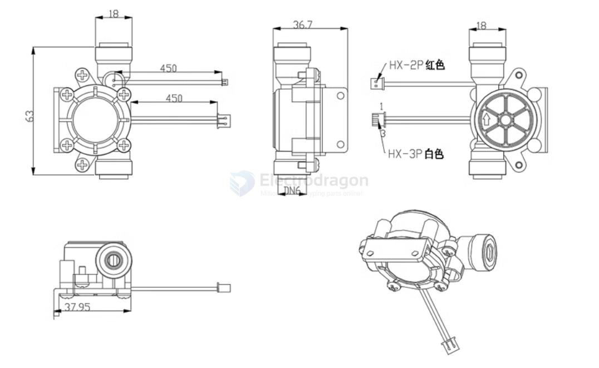

# EDWater3-dat.md

## Specs

| Parameter                                          | Value                                                                       |
| -------------------------------------------------- | --------------------------------------------------------------------------- |
| Minimum Rated Working Voltage                      | DC3.5V-24V                                                                  |
| Maximum Working Current                            | 15mA(DC5V)                                                                  |
| Working Voltage Range                              | DC5~18V                                                                     |
| Load Capacity                                      | ≤10mA(DC 5V)                                                                |
| Operating Temperature Range                        | ≤80℃                                                                        |
| Operating Humidity Range                           | 35%～90%RH (No icing)                                                       |
| Allowable Pressure Resistance                      | ≤0.8MPA                                                                     |
| Storage Temperature                                | -25~+80°℃                                                                   |
| Storage Humidity                                   | 25%~95%RH                                                                   |
| Output Pulse High Level                            | >DC 4.5V(Input Voltage DC5V)                                                |
| Output Pulse Low Level                             | <DC0.5V(Input Voltage DC5V)                                                 |
| Accuracy (Flow Rate - Pulse Output)                | 0.3~6L/min±3%                                                               |
| Output Pulse Duty Cycle                            | 50±10%                                                                      |
| Output Rise Time                                   | 0.04μS                                                                      |
| Output Fall Time                                   | 0.18μS                                                                      |
| Flow Rate - Pulse Characteristic (Horizontal Test) | Pulse Frequency (Hz) = [36*Q]+3% *note1 |

*note1 == (Horizontal Test, Q is flow rate in L/min)

## wiring

- red + blue  == TDS
- middle green == temp 
- middle yellow == flow speed
- black == GND
- red == VCC