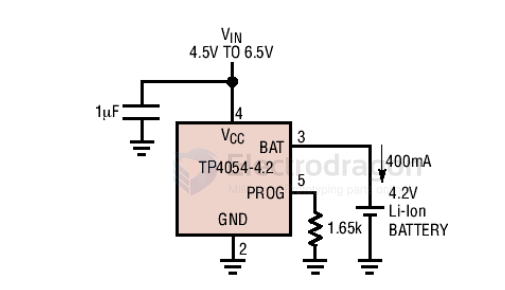
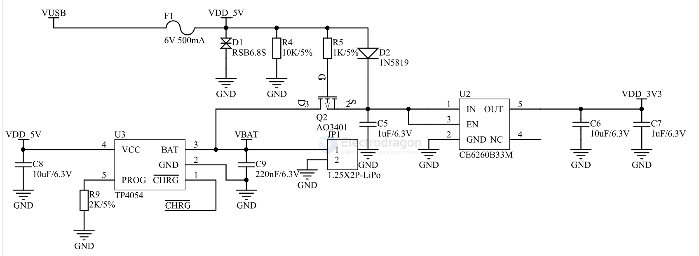
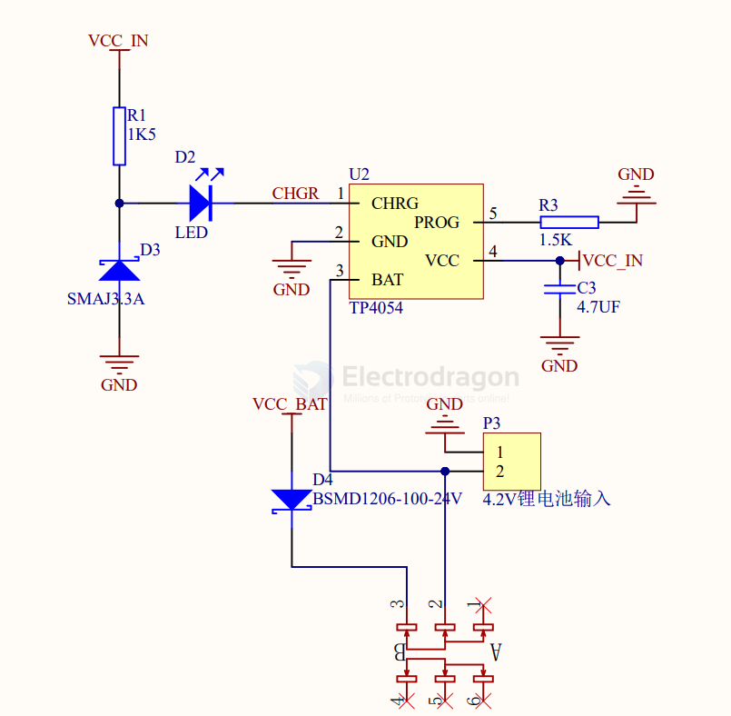

# TP4054-dat

## setup 

- R_prog = 4.7K == 

## APP 

DESCRIPTION

The TP4054 is a complete constant-current/constant-voltage linear charger for single cell
lithium-ion batteries. Its SOT package and low external component count make the TP4054
ideally suited for portable applications. Furthermore, the TP4054 can work within USB and wall
adapter.

No external sense resistor is needed, and no blocking diode is required due to the internal
PMOSFET architecture and have prevent to negative Charge Current Circuit. Thermal feedback
regulates the charge current to limit the die temperature during high power operation or high
ambient temperature. The charge voltage is fixed at 4.2V, and the charge current can be
programmed externally with a single resistor. The TP4054 automatically terminates the charge
cycle when the charge current drops to 1/10th the programmed value after the final float voltage is
reached.

When the input supply (wall adapter or USB supply) is removed, the TP4054 automatically enters
a low current state, dropping the battery drain current to less than 2uA. The TP4054 can be put
into shut down mode, reducing the supply current to 45uA. Other features include current monitor,
under voltage lockout, automatic recharge and a status pin to indicate charge termination and the
presence of an input voltage.

FEATURES

· Programmable Charge Current Up to
800mA
·No MOSFET, Sense Resistor or Blocking
Diode Required
·Complete Linear Charger in SOT23-5
Package for Single Cell Lithium-Ion
Batteries
·Constant-Current/Constant-Voltage
Operation with Thermal Regulation to
Maximize Charge Rate Without Risk of
Overheating
·Charges Single Cell Li-Ion Batteries Directly
from USB Port
·Preset 4.2V Charge Voltage with 1%
Accuracy
·Charge Current Monitor Output for Gas
Gauging
·Automatic Recharge
·Charge Status Output Pin
·C/10 Charge Termination
·45uA Supply Current in Shutdown
·2.9V Trickle Charge Threshold (TP4054)
·Soft-Start Limits Inrush Current
·Available in 5-Lead SOT-23 Package
APPLICATIONS
·Cellular Telephones, PDAs, MP3 Players
·Charging Docks and Cradles
·Blue tooth Applications
TYPICAL APPLICATION
600mA Single Cell Li-lon Charger 

## charge current 

When we need IBAT＝0.4A RPROG＝1.66kΩ

When we need IBAT＝0.1A RPROG＝10kΩ

## SCH 1 + 6206 

- [[LDO-dat]] - [[ME6206-dat]]

## SCH 2 

## ref 

- [[TP-dat]]