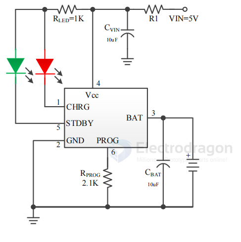

# TP4057-dat

## TP4057 Features Checklist

### Core Charging Features
- [ ] 500mA Linear Li-ion Battery Charger
- [ ] Single-cell lithium battery charging
- [ ] Trickle charging mode
- [ ] Constant current charging mode
- [ ] Constant voltage charging mode
- [ ] 4.2V fully charged voltage
- [ ] External resistor for charging current setting
- [ ] Automatic charge termination (when current drops to 1/10 set value)

### Protection Features
- [ ] Battery reverse polarity protection
- [ ] Input power reverse polarity protection
- [ ] Thermal feedback (auto-adjusts current to limit chip temperature)
- [ ] Undervoltage lockout
- [ ] No external detection resistors needed
- [ ] No isolation diodes required

### Power Management
- [ ] USB power source compatibility
- [ ] AC adapter power source compatibility
- [ ] Power adaptation
- [ ] Low current state when input removed (<1μA battery leakage)
- [ ] Automatic recharge capability

### Status & Monitoring
- [ ] Two status pins for monitoring
- [ ] Charging completion indication
- [ ] Input voltage connection indication

### Package & Design
- [ ] SOT23-6 package
- [ ] Minimal external components required
- [ ] Internal PMOSFET architecture
- [ ] Anti-reverse charging circuit
- [ ] Optional R1 dissipation resistor (0.3Ω recommended, 0~0.6Ω range)

### Applications
- [ ] Portable device charging
- [ ] USB-powered charging applications
- [ ] Adapter-powered

## TP4057 

500mA Linear Li-ion Battery Charger

The TP4057X is a complete single-cell lithium battery charger with **battery reverse polarity protection** and **input power reverse polarity protection**, all in a single chip, and supports a charging current of 500mA.

Using trickle, constant current, and constant voltage control, the SOT23-6 package and minimal external components make the TP4057X an ideal choice for portable applications.

The TP4057X is suitable for both USB power and adapter power sources. Thanks to its internal PMOSFET architecture and anti-reverse charging circuit, there is no need for external detection resistors or isolation diodes.

Thermal feedback automatically adjusts the charging current to limit the chip temperature during high-power operation or high ambient temperature conditions.

The fully charged voltage is 4.2V. The charging current can be set externally with a resistor.

When the battery reaches the preset voltage, the charging current drops to 1/10 of the set value, and the TP4057X will automatically terminate charging.

When the input voltage (AC adapter or USB power) is removed, the TP4057X automatically enters a low current state, with battery leakage current below 1μA.

Other features of the TP4057X include **power adaptation, undervoltage lockout, automatic recharge, and two status pins** for indicating charging completion and input voltage connection.

注：建议接R1耗散电阻（0.3Ω），可获得较大的充电电流，又可提高整机的可靠性。阻值根据实际情况选取（0~0.6Ω）。

## PROG 

- 2.1K
- 3K 
- 3.3K 

## ref 

- [[TP-dat]]