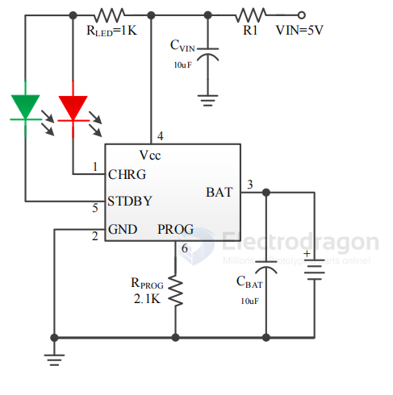

# TP-dat

- [[TP]]

- [[TP4056-dat]]

- [[TP4067-dat]] - [[TP4057-dat]] - [[TP4055-dat]] - [[TP4059-dat]] - [[TP4062-dat]] - [[TP4058-dat]]

- [[TP4083-dat]]

http://www.tpwic.com/

## TP4083

3mA-500mA Linear Li-ion Battery Charger with OVP

The TP4083 is a single-cell lithium battery charger with OVP (over-voltage protection), battery reverse polarity protection, and input power reverse polarity protection, all in a single chip. It supports a wide charging current range from 3mA to 500mA. Using trickle, constant current, and constant voltage control, the SOT23-6 or DFN2*2-6 package and minimal external components make the TP4083 an ideal choice for portable applications. The TP4083 is suitable for both USB power and adapter power sources.

The 16V over-voltage protection feature allows the chip to be used in applications requiring a wider and higher input voltage range. When the input voltage is between 6.5V and 16V, the chip can still provide some output current to charge the battery, reducing charging time. The chip’s thermal feedback automatically adjusts the charging current to limit the chip temperature during high-power operation or high ambient temperature conditions. When the battery reaches the preset voltage, the charging current drops to 1/10 of the set value, and the TP4083 will automatically terminate charging.

When the input voltage (AC adapter or USB power) is removed, the TP4083 automatically enters a low current state, with battery leakage current below 1μA. Other features of the TP4083 include power undervoltage lockout, automatic recharge, and two status pins for indicating charging completion and input voltage connection.

## TP4067 

3mA-600mA Linear Li-ion Battery Charger

The TP4067 is a complete single-cell lithium battery charger, the world's first single-chip solution with battery reverse polarity protection and input power reverse polarity protection. It supports a wide charging current range from 3mA to 600mA.

Using trickle, constant current, and constant voltage control, the SOT23-6 package and minimal external components make the TP4067 an ideal choice for portable applications. The TP4067 is suitable for both USB power and adapter power sources.

Thanks to its internal PMOSFET architecture and anti-reverse charging circuit, there is no need for external detection resistors or isolation diodes. Thermal feedback automatically adjusts the charging current to limit the chip temperature during high-power operation or high ambient temperature conditions.

The fully charged voltage can be set to four levels: 4.35V, 4.2V, 3.7V, and 2.8V. The charging current can be set externally with a resistor. When the battery reaches the preset voltage, the charging current drops to 1/10 of the set value, and the TP4067 will automatically terminate charging.

When the input voltage (AC adapter or USB power) is removed, the TP4067 automatically enters a low current state, with battery leakage current below 1μA. Other features of the TP4067 include power adaptation, undervoltage lockout, automatic recharge, and two status pins for indicating charging completion and input voltage connection.

**Schematic is the same as TP4057 as below**

## TP4057 

500mA Linear Li-ion Battery Charger

The TP4057X is a complete single-cell lithium battery charger with battery reverse polarity protection and input power reverse polarity protection, all in a single chip, and supports a charging current of 500mA.

Using trickle, constant current, and constant voltage control, the SOT23-6 package and minimal external components make the TP4057X an ideal choice for portable applications.

The TP4057X is suitable for both USB power and adapter power sources. Thanks to its internal PMOSFET architecture and anti-reverse charging circuit, there is no need for external detection resistors or isolation diodes.

Thermal feedback automatically adjusts the charging current to limit the chip temperature during high-power operation or high ambient temperature conditions.

The fully charged voltage is 4.2V. The charging current can be set externally with a resistor.

When the battery reaches the preset voltage, the charging current drops to 1/10 of the set value, and the TP4057X will automatically terminate charging.

When the input voltage (AC adapter or USB power) is removed, the TP4057X automatically enters a low current state, with battery leakage current below 1μA.

Other features of the TP4057X include power adaptation, undervoltage lockout, automatic recharge, and two status pins for indicating charging completion and input voltage connection.

注：建议接R1耗散电阻（0.3Ω），可获得较大的充电电流，又可提高整机的可靠性。阻值根据实际情况选取（0~0.6Ω）。

## ref 

- [[battery-charger-dat]]