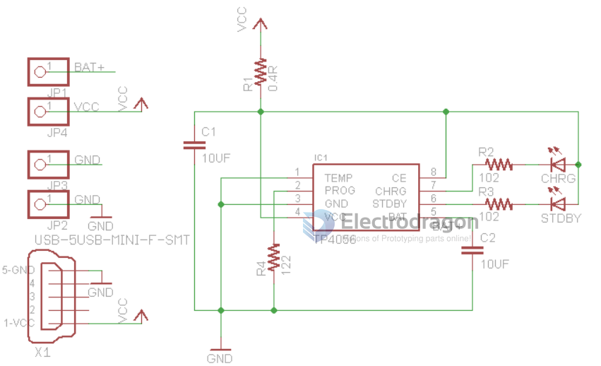
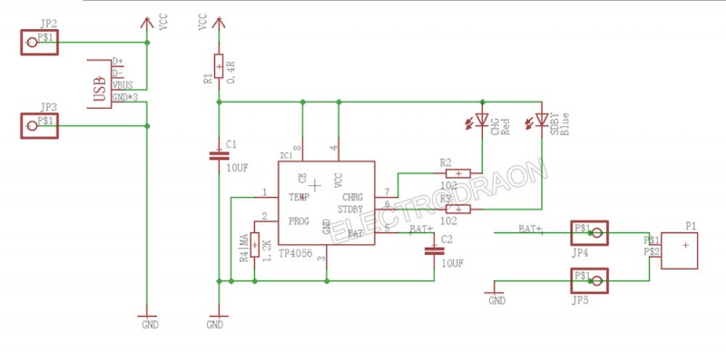

# TP4056-dat

- legacy wiki page - https://w.electrodragon.com/w/TP4056

## Parameters 

cacultation: 

    Ibat = charge current = Vprog / Rprog * 1200

    where Vprog = 1V 

| Rprog | Ibat   | calculation   |
| ----- | ------ | ------------- |
| 1.2K  | 1A     | 1.2/1.2 = 1   |
| 120 R | 10 A   | 1.20.12 = 10  |
| 2.4K  | 500 mA | 1.2/2.4 = 0.5 |

## SCH 

## ref 

- datasheet - [[TP4056.pdf]]