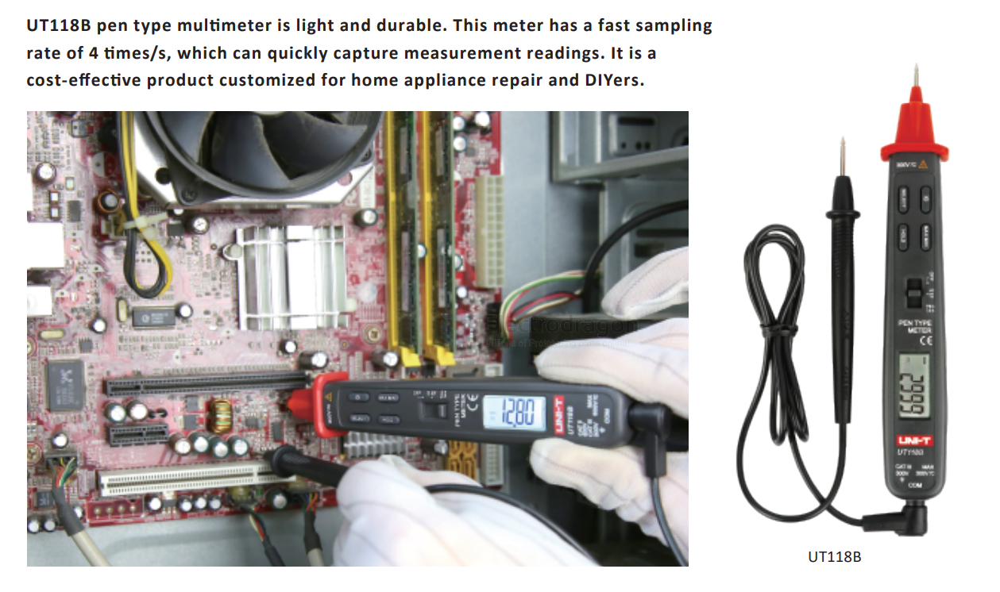

# UNI-Trend-dat

Uni-Trend Technology (China) Co., Ltd. is one of the well-known test and measurement solutions provider in Asia. Uni-Trend is an ISO9001 and ISO14001 certified company, with T&M products meeting certifications including CE, ETL, UL, GS, etc.

## UT890C 

## UT118C Digital Multimeter

## UT118B Pen Type Digital Multimeter

Company profile
Year:

1988

SSE Code:

688628

Uni-Trend:

“Test & Measurement
Products and Solutions Provider”

优利德科技（中国）股份有限公司

## ref 

- [[UNI-Trend]] - [[multimeter]]