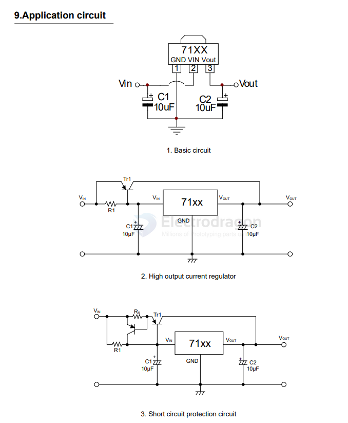

# HT71xx-dat

- [[UWM-dat]] - [[HT71xx-dat]] - [[chip-cn-dat]] - [[holtek-dat]]

2.Features

- Low power consumption: ≤ 3μA
- Low drop voltage: typical value 0.1V
- Low temperature bleaching: typical 50 ppm/°C
- High input voltage: up to 30V
- High precision output voltage: tolerance of + 3%
- Package form: TO-92, sot89-3, sot-23-3

## SCH 

## ref 

