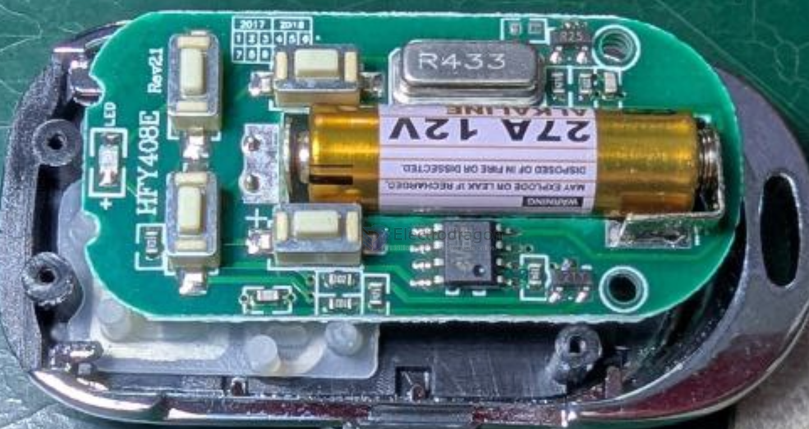

# EV1527-dat

## Info 

chip info, datasheet == [[EV1527.pdf]], etc.

EV1527 is a widely used **fixed-code OOK (On-Off Keying) modulation** scheme that transmits a **20-bit ID** plus **4-bit data**. The encoding consists of a preamble, a synchronization bit, and the data transmission using a specific pulse width format.

- [[OOK-dat]]

Originally, EV1527 was a proprietary chip manufactured by a Chinese company which then found so widespread adoption in affordable remote controls that its encoding scheme became a standard by itself.

EV1527 uses a fixed message format and does not have cryptographic protection. It is vulnerable to replay attacks where an attacker would listen for RF transmissions from a remote control, then play it back later to mimick the original remote control.

However, radio waves are public. Anyone can listen in, or send. **EV1527 is not encrypted and uses repetitive (predictable) messages.**

## not security critical

EV1527 is great for any simple microcontroller-free scenario that is not security critical. Use it for toys, to turn on garden lamps, or alike.

**Microcontroller Available:** If your project already uses a microcontroller, use a generic OOK sender/receiver and implement the encoding yourself/sniffingrfremotes/). This way, you can add security features such as rolling codes and encryption.

If your project is security critical, consider wireless methods that come **with encryption by default (i.e. ESPNow, WiFi, etc.).** At minimum, use rolling codes that cannot be easily captured and replayed. EV1527 can be used in replay attacks from anyone close enough to receive the signals from your remote control.

Keep in mind that especially **a garage door opener** is a **highly security-sensitive device**. Anyone close enough to pick up your remote control signal can gain entry at his or her convenience when the remote control uses EV1527.

## RF and Frequencies

Typically, EV1527-compliant remote controls use the license-free 315MHz ISM band in the US, and the license-free 433MHz ISM band in Europe and Asia.

- 315.00 MHz: the 315MHz band has just one channel at exactly **315.00MHz.**
- 433.92 MHz: the 433MHz band has a total bandwidth of 1.72MHz, offering room for up to **174 channels**. 
- EV1527-devices operate on channel 87 (**433.92 MHz**) which is the center frequency of this band.

## Transmitter == OOK Sender 

- 4x button version 
- 12V 27A battery == [[A27-battery-dat]] -> [[battery-alkaline-dat]]

## App. 

- [[RF-link-dat]]

## ref 

- [[EV1527]] 

- https://done.land/components/data/datatransmission/wireless/shortrangedevice/am/ask/ev1527/