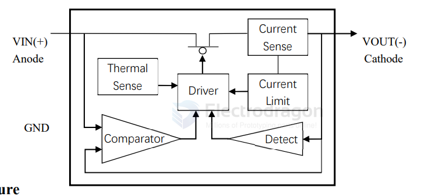
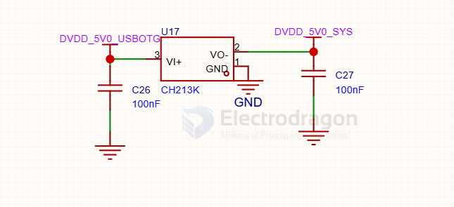

# CH213-dat

- [[CH213-dat]] - [[WCH-dat]] - [[diode-ideal-dat]]

## info 

CH213 is a low dropout ideal diode chip with current limiting function. The chip has integrated modules for overcurrent protection, short-circuit protection, over-temperature protection, power supply polarity protection, etc. It
supports DC applications with no more than 1A current at 5V, and can protect the power supply system by limiting
the output current when an over-current condition such as a short-circuit occurs at the VO output, and can protect
the load circuit at the VO output when the input power supply polarity is wrong.

The CH213 is equivalent to a Schottky Barrier Diode plus a self-recovery fuse, but with a substantially lower onvoltage drop and more rapid over-current protection.

The following is the internal block diagram of CH213 for reference only. 

## SCH or diagram 

## build 

## ref 

