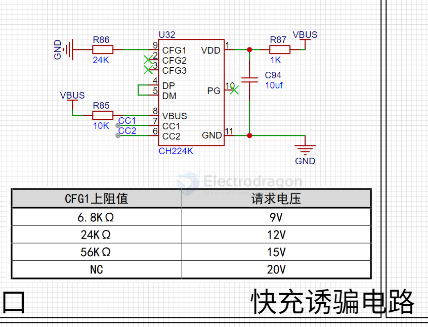

# CH224-dat

- [[USB-FC-trigger-dat]]

- datasheet == [[ch224ds1.pdf]]

CH224Q/CH224A are USB PD fast charging protocol sink chips supporting USB PD3.2, with a maximum PD3.2 EPR power of 140W. They support single resistor configuration, I/O level configuration, and I2C configuration. The protocol handshake status and current PD voltage/current rating can be read via the I2C interface. The chip has a built-in high-voltage LDO, low static power consumption, high integration, and simplified external circuitry. It also integrates output voltage detection and overvoltage protection, making it widely applicable for expanding high-power input in various electronic devices such as wireless chargers, small appliances, lithium battery power tools, and more.

CH224K/CH224D/CH221K are USB PD fast charging protocol sink chips supporting USB PD3.0, with a maximum power of 100W. They support single resistor configuration and I/O level configuration.

Features

- Supports input voltage from 4V to 30V
- Supports PD3.2 EPR, AVS, PPS, SPR protocols, and BC1.2 boost fast charging protocols
- Supports eMarker emulation and automatic VCONN detection
- Supports multiple methods for dynamically adjusting requested voltage
- Supports 400KHz I2C communication
- Built-in high-voltage LDO, low static power consumption
- High integration in a single chip, simplified external circuitry, low cost
- Built-in overvoltage protection module (OVP)

## SCH 

## ref 

- [[USB-PD-dat]] - [[USB-BC-dat]]