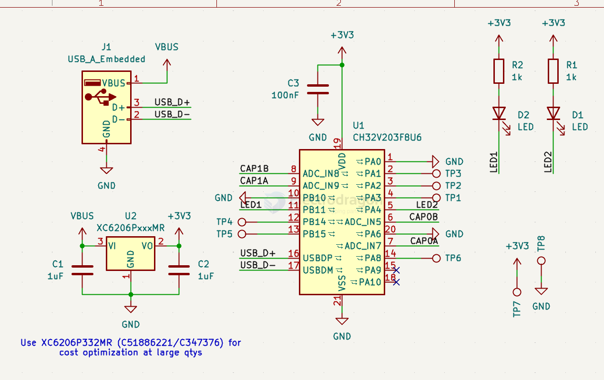

# CH32-dat

- [[CH32V003-dat]] - [[CH32V103-dat]]

Genuine CH32V003F4P6 TSSOP-20 RISC-V core 32-bit microcontroller (MCU)

- [[CH32-dat]] - [[WCH-MCU-dat]] - [[CH32V003-dat]] - [[WCH-dat]]

`CH32V203` V203F8 - CH32V203V203F8

- MCU – WCH CH32V203V203F8
- CPU – Single-core 32-bit RISC-V clocked at 144MHz
- Memory – 20KB SRAM
- Storage – 224KB Flash (64KB of 0-wait Flash and 160KB of normal Flash)
- Package – QFN28

## ref 

