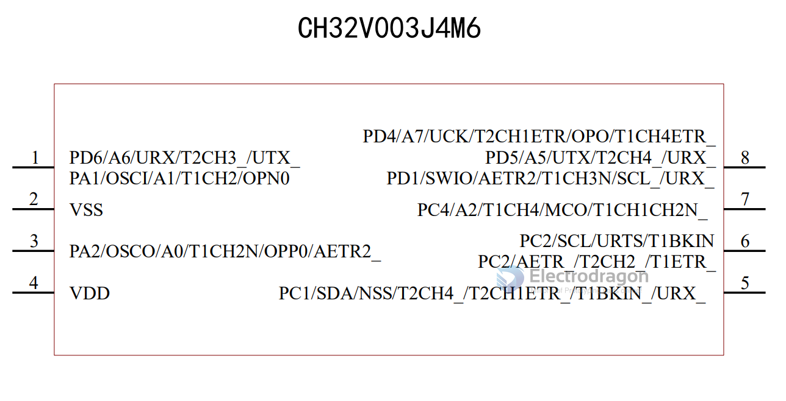

# CH32V003-dat 

- [[CH32V103-dat]]

## HDK

### 标准通讯接口 

- 1 个USART 接口 
- 1 个I2C 接口 
- 1 个SPI 接口

### 烧写 Prog 

- SWIO = PD1 / PD4 / PD5 
- 调试模式：串行单线调试接口
- [[WCHLink-dat]] - [[SWIO-dat]] - [[MounRiver-dat]] - [[WCH-PROG-dat]]

### Compile project

- Download sample code: https://www.wch.cn/downloads/CH32V003EVT_ZIP.html
- After decompression, in MounRiver File -> Load -> Project, open GPIO_Toggle.wvproj in the EVT\EXAM\GPIO\GPIO_Toggle directory
- Just press Shift + F7 or compile through the toolbar button. If the compilation is normal, it will be displayed.

## Note

### Not supported by WCH-LINK

    ------------ Begin flash process of "obj\GPIO_Toggle.hex" ------------ 
    18:05:29:565 >> Current project vendor is WCH, debugger is WCH-Link

    18:05:29:565 >> Attempt to open link device and upgrade firmware if necessary...
    18:05:29:621 >> Link Device is CH549. Already the latest version v2.10, no need to upgrade

    18:05:29:693 >> Starting to Handle Operations...
    18:05:29:720 >> Current WCH-Link doesn't support this chip.
    Current WCH-Link doesn't support this chip. Please refer to "WCH-LinkUserManual.pdf" for more help.

    18:05:29:720 >> Starting to Close Link...
    18:05:29:720 >> Close Link Success
    ---------------------------------End ---------------------------------

## demo 

- https://www.youtube.com/watch?v=v3h-EoI-HIQ

## ref 

- [[CH32V003]]