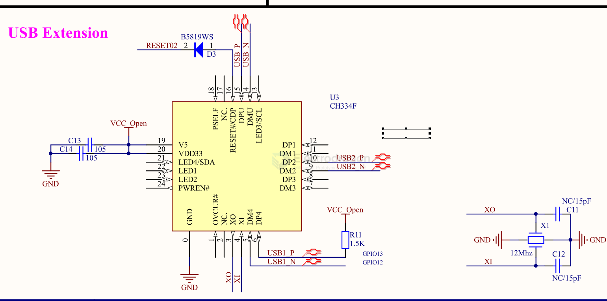
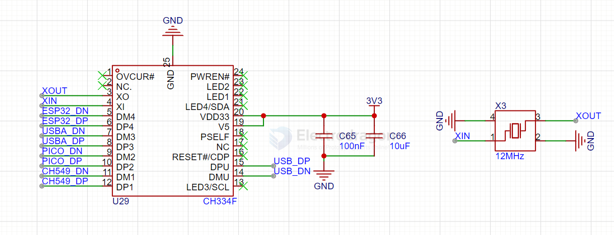
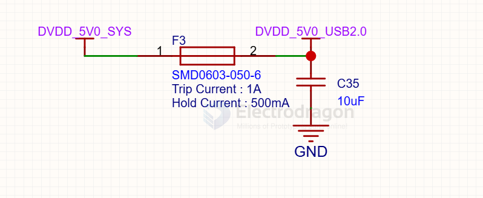
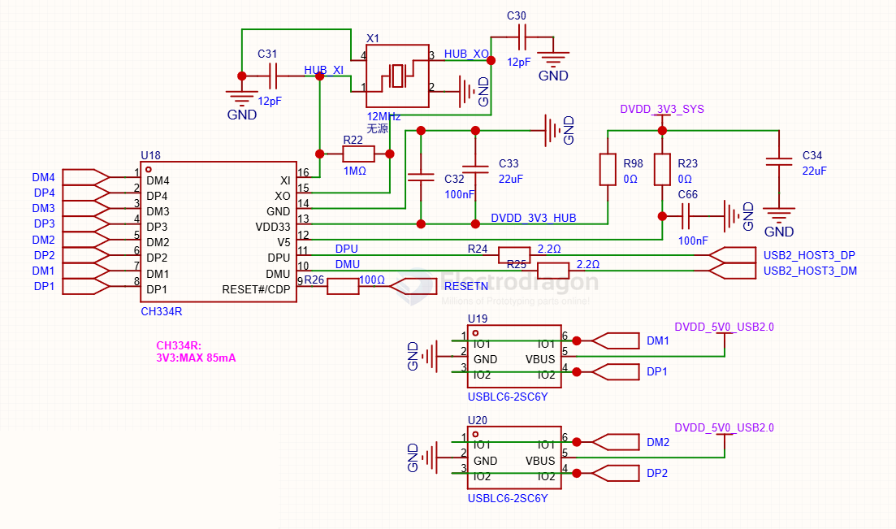
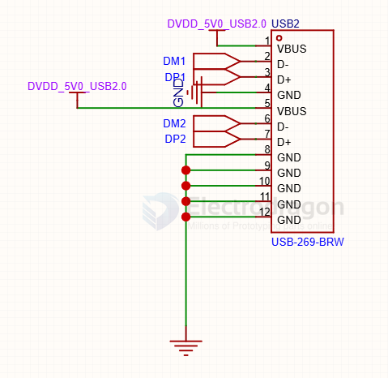

# CH334-dat

## SCH 

- [[USB-hub-dat]] - [[CH334-dat]] - [[WCH-dat]]

工业级应用建议将V5和VDD33都接到外供的3.3V电源，使HUB芯片的最大功耗从85mA*5V降低到85mA*3.3V，有利于减小HUB芯片的压降和温升。实测可支持扩展工业级温度范围-40℃～105℃，并且在125℃时短期可用（部分参数会超）。

注意，保险电阻和USB电源开关芯片可能不支持高温。CH334Q没有内部LD0降压调节器和V5引脚，所有VDD33都需要接到外供的3.3V电源。

## CH334 

项目采用CH334F将一路usb信号拓展至四路，其中ESP32S3、RP2040和CH549G各连接一路，另外的一路由一个usbA口引出，可以外接usb设备同时为开发板或者手机供电。

## build 

build 1 

USB HUB分配：
1+2:给用户的外插
3:RTL8723(其中USB可以切断)
4:Pico I/O

## ref 

- [[wch-dat]]