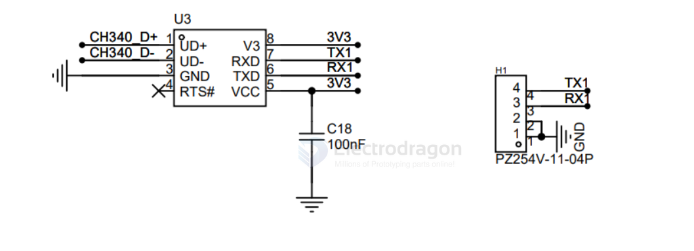
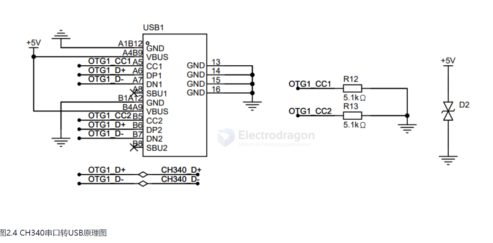

# CH340 DAT

## CH340 
- install driver with common CH340 driver 
- USB device should be found as: USB-SERIAL CH340K (COM161)

## DS 

| model  | link            | footprint | note                     |
| ------ | --------------- | --------- | ------------------------ |
| CH340G | [[CIC1030-dat]] | SOP-16    |                          |
| CH340C | [[CIC1031-dat]] | SOP-16    | no need external crystal |
| CH340B |                 | SOP-16    |                          |
| CH340K |                 | ESSOP-10  |                          |
| CH340E | [[CIC1029-dat]] | MSOP-10   |                          |
| CH340N |                 |           |                          |
| CH340T | 
| CH340X |

## Hardware 

V3 pin 
- 在3.3V 电源电压时连接VCC 输入外部电源， 
- 在5V 电源电压时外接容量为0.1uF 退耦电容

## datasheet and driver

- [[CH340N-dat]]

- [[WCH-Jiangsu-Qin-Heng-CH340.pdf]]

- [[CH340SER.zip]]

## SCH 

此电路用于用户连接系统调试中断使用，其功能为将TTL串口转换为USB接口，使得用户可以在电脑中连接该串口进行调试。

需要注意的是，由于F1C200S的UART0接口(PE0/PE1引脚)被触摸的I2C接口占用，所以本开发板将CH340的串口连接到了F1C200S的UART1(PA2/PA3引脚)上，后续编译U-Boot和内核时我们需要相应的修改代码。

如上图所示，该部分除了串口转USB外，还兼顾的系统的供电，用户通过Type-C线缆连接该调试口后，将同时为开发板供电。板上的5.1K电阻用于双头Type-C线缆识别从机，为其提供供电，如果R12,R13不焊接会导致使用双头Type-C线时板子没有供电。D2为TVS瞬态抑制二极管用于保护PCB板上原件，防止静电击穿原件。

## ref 

- legacy wiki page https://w.electrodragon.com/w/Category:CH340

