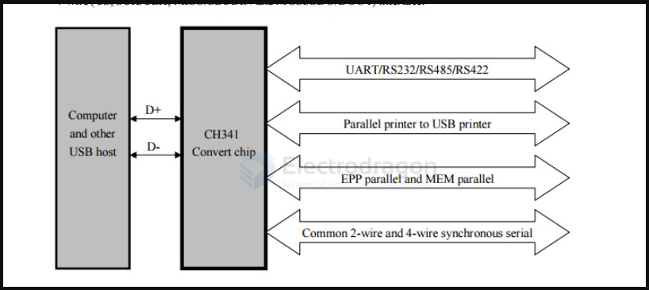

# CH341 DAT

http://www.wch-ic.com/downloads/CH341SER_EXE.html

## working principle 

## supported devices 

* providing UART, printer port, parallel and synchronous serial with 2-wire or 4-wire through USB bus. 

* Supported 25 Series ICs
* AMIC: A25L512          A25L05P          A25L10P          A25L010          A25L020          A25L20P          A25L40P          A25L040          A25L080          A25L80P          A25L016          A25L16P          A25L032
* ATMEL: AT25F512          AT25F512B          AT25F512A          AT25FS010          AT25F1024          AT25F1024A          AT25F2048          AT25DF021          AT25F4096          AT25FS040 AT25DF041A          AT26F004          AT26DF081A          AT25DF161          AT26DF161          AT26DF161A          AT25DF321A          AT26DF321          AT25DF321          AT25DF641
* COMMON: 25X005          25X05          25X10          25X20          25X40          25X80          25X16          25X32          25X64          25X128          25X256          25X512          25X1024          25X2048
* EON: EN25F05          EN25P05          EN25LF05          EN25F10          EN25LF10          EN25D10          EN25P10          EN25F20          EN25D20          EN25LF20          EN25F40          EN25D40          EN25LF40          EN25Q80          EN25D80          EN25F80          EN25P80          EN25T80          EN25B16T          EN25T16          EN25B16          EN25D16          EN25F16          EN25Q16          EN25P32          EN25Q32          EN25F32          EN25B32          EN25B32T          EN25Q64          EN25B64          EN25F64          EN25B64T          EN25F128          EN25Q128
* ES: ES25P10          ES25P20          ES25M40A          ES25M40          ES25P40          ES25M80          ES25M80A          ES25P80          ES25M16          ES25M16A          ES25P16          ES25P32
* ESMT: F25L04UA          F25L004A          F25L08PA          F25L008A          F25L016A          F25L16PA          F25L32QA          F25L32PA
* GIGADEVICE: GD25Q512          GD25Q10          GD25Q20          GD25F40          GD25D40          GD25Q80          GD25D80          GD25T80          GD25F80          GD25Q16          GD25Q32          GD25Q64          GD25Q128
* KH: KH25L8036D
* MXIC: MX25V512          MX25L512          MX25L1005          MX25L2005          MX25L8035          MX25L4005A          MX25V4035          MX25V4005          MX25V8005          MX25L8005          MX25L1635D          MX25L1605D          MX25L1608D          MX25L3235D          MX25L3208D          MX25L3237D          MX25L3225D          MX25L3205D          MX25L3206E         MX25L6405D          MX25L6455E          MX25L6408D          MX25L6406E          MX25L6445E          MX25L12805D          MX25L12845E        
* NEXFLASH: NX25P10          NX25P20          NX25P40          NX25P80          NX25P16          NX25P32
* NSHINE: MS25X05          MS25X10          NS25X20          NS25X40          MS25X80          MS25X16          MS25X32          MS25X64          MS25X128
* PMC: PM25LV512A          PM25LV010A          PM25LV020          PM25LV040          PM25LV080B          PM25LV016B
* SAIFUN: SA25F005          SA25F010          SA25F020          SA25F040          SA25F080          SA25F160          SA25F320
* SPANSION: S25FL004A          S25FL040A          S25FL008A          S25FL160          S25FL016A          S25FL032A          S25FL064A          S25FL128P          S25FL129P          S25FL128A
* SST: SST25VF512A          SST25VF512          SST25VF010          SST25VF010A          SST25VF020A          SST25VF020          SST25VF040B          SST25VF040A          SST25VF040          SST25VF080B          SST25VF016B          SST25VF032B          SST25VF064C
* ST: M25P05A          M25PE10          M25P10A          M25P20          M25PE20          M25PE40          M25P40          M25PE80          M25P80          M25PX80          M25PX16          M25P16          M25PE16          M25P32          M25PE32          M25PX32          M25PX64          M25P64          M25PE64          M25P128
* WINBOND: W25X10          W25X10L          W25P10          W25X10AL          W25X10A          W25P20          W25X20AL          W25X20A          W25X20          W25X20L          W25X40A          W25P40          W25Q40BV          W25X40L          W25X40          W25X40AL          W25Q80BV          W25Q80V          W25X80          W25P80          W25X80A          W25X80L         W25X80AL          W25P16          W25Q16BV          W25Q16V          W25X16          W25Q32BV          W25Q32V          W25X32          W25P32          W25Q64BV          W25X64          W25Q128BV
* 24 Series ICs
* ATMEL:AT24C01B          AT24C01          AT24C01A          AT24C02          AT24C02A          AT24C02B          AT24C04B          AT24C04          AT24C04A          AT24C08A          AT24C08B          AT24C08          AT24C16          AT24C16A          AT24C16B          AT24C32B          AT24C32A          AT24C32          AT24C64          AT24C64A          AT24C64B          AT24C128          AT24C128A          AT24C128B          AT24C256B          AT24C256          AT24C256A          AT24C512B          AT24C512A          AT24C512          AT24C1024          AT24C1024A          AT24C1024B
* CATALYST:CAT24C01          CAT24WC01          CAT24WC02          CAT24C02          CAT24C04          CAT24WC04          CAT24WC08          CAT24C08          CAT24WC16          CAT24C16          CAT24WC32          CAT24C32          CAT24WC64          CAT24C64          CAT24WC128          CAT24C128          CAT24WC256          CAT24C256          CAT24C512          CAT24WC512          CAT24C1024          CAT24WC1024
* COMMON: 24C01 3V          24C01 5V          24C02 3V          24C02 5V          24C04 5V          24C04 3V          24C08 3V          24C08 5V          24C16 5V          24C16 3V          24C32 5V          24C32 3V          24C64 5V          24C64 3V          24C128 5V          24C128 3V          24C256 5V          24C256 3V          24C512 5V          24C512 3V          24C1024 3V          24C1024 5V          24C2048 5V          24C2048 3V          24C4096 5V          24C4096 3V
* FAIRCHILD: FM24C01L          FM24C02L          FM24C03L          FM24C04L          FM24C05L          FM24C08L          FM24C09L          FM24C17L          FM24C16L          FM24C32L          FM24C64L          FM24C128L          FM24C256L          FM24C512L          FM
* HOLTEK: HT24C01          HT24LC01          HT24C02          HT24LC02          HT24C04          HT24LC04          HT24C08          HT24LC08          HT24C16          HT24LC16          HT24LC32          HT24C32          HT24LC64          HT24C64          HT24C128          HT24LC128          HT24C256          HT24LC256          HT24LC512          HT24C512          HT24C1024          HT24LC1024
* ISSI: IS24C01          IS24C02          IS24C04          IS24C08          IS24C16          IS24C32          IS24C64          IS24C128          IS24C256          IS24C512          IS24C1024
* MICROCHIP: MIC24LC014          MIC24AA01          MIC24AA014          MIC24LC01B          MIC24LC02B          MIC24AA02          MIC24C02C          MIC24AA025          MIC24AA04          MIC24LC04B          MIC24LC024          MIC24AA024          MIC24LC025          MIC24LC08B          MIC24AA08          MIC24LC16B          MIC24AA16          MIC24LC32          MIC24AA32          MIC24LC64          MIC24FC64          MIC24AA64          MIC24FC128          MIC24AA128          MIC24LC128          MIC24AA256          MIC24LC256         MIC24FC256          MIC24AA512          MIC24LC512          MIC24FC512          MIC24AA1024
* NSC: NSC24C02L          NSC24C02          NSC24C64
* RAMTRON: FM24CL04          FM24C04A          FM24CL16          FM24C16A          FM24CL64          FM24C64          FM24C256          FM24CL256          FM24C512
* ROHM: BR24L01          BR24C01          BR24L02          BR24C02          BR24L04          BR24C04          BR24L08          BR24C08          BR24L16          BR24C16          BR24L32          BR24C32          BR24C64          BR24L64
* ST: ST24C01          ST24C02          ST24C04          ST24C08          ST24C16          ST24C32          ST24C64
* XICOR: X24C01          X24C02          X24C04          X24C08          X24C16

## SCH

## programming software  

- [AsProgrammer](https://github.com/nofeletru/UsbAsp-flash)
- [NeoProgrammer CH341A](https://4pda.to/forum/index.php?showtopic=884713&st=3760#entry96411343)

common supported devices 

- AT25
- GD25 
- IS25 
- ...

- [[CH341]]

