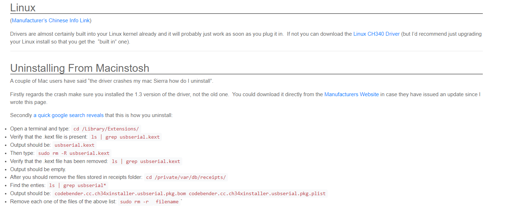

# CH343-dat 

- [[serial-dat]]

## Features 

- Full speed USB device interface, USB 2.0 compatible.
- Built-in firmware, emulate standard UART interface, used to upgrade the original serial peripherals or expand additional UART via USB.
- Original serial applications are totally compatible without any modification in Windows operating systems.
- Supports free installation OS which built-in CDC driver or multi-functional high-speed VCP vendor driver.
- Hardware full duplex UART interface, integrated independent transmit-receive buffer, supports communication baud rate varies **from 50bps to 6Mbps.**
- Supports automatic identification and dynamic adaptation of common communication baud rate of 115200bps and below.
- UART supports 5, 6, 7 or 8 data bits, and supports odd, even, space, mark and none parity.
- Supports common MODEM interface signals RTS, DTR, DCD, RI, DSR and CTS.
- Supports CTS and RTS hardware automatic flow control.
- Supports half-duplex, provides sending status TNOW, used for controlling RS485 to transmit-receive switch.
- Supports RS232 interface, through external voltage conversion chip.
- Supports 5V and 3.3V power supply voltages.
- UART interface I/O powered independently, supports 5V, 3.3V, 2. 5 V and 1.8V power supply voltages.
- Integrated power-on reset, integrated clock, no external crystal required.
- Built-in EEPROM used to configure the chip of VID, PID, maximum current value, vendor and product information string, etc.
- Integrated Unique ID (USB Serial Number).
- RoHS compliant SOP16, ESSOP10 and QFN16 lead-free package.

## Setup 

## linux 

## ref 

- [[CH343DS1.pdf]]

- https://www.wch-ic.com/products/CH343.html
- https://www.wch.cn/products/CH343.html