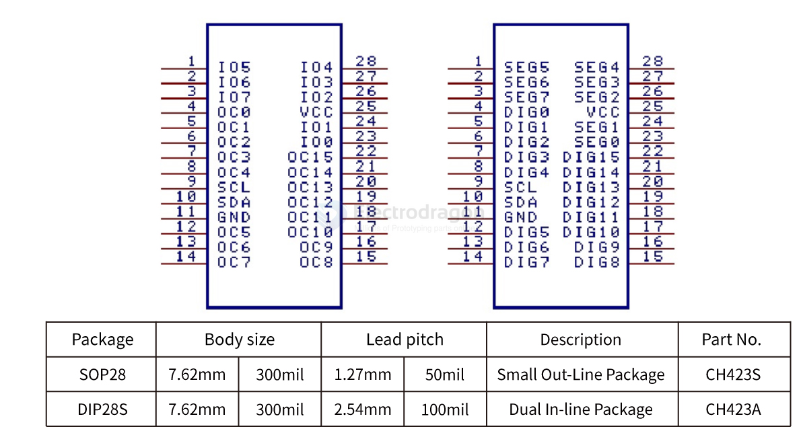

# CH423-dat

https://www.wch-ic.com/products/CH423.html

- [[CH423DS1.PDF]]

## code refe

folked library as below: 

- Linux driver for WCH CH423 - https://github.com/Edragon/ch423-gpio-expander

- raspberry pi demo code - https://github.com/Edragon/CH423

- [[ch423-ard-demo-blink.ino]] - [[ch423-ard-demo-group.ino]] - [[ch423-ard-demo-input.ino]] - [[ch423-ard-demo-ioInterrupt.ino]] - [[ch423-ard-demo-pollInterrupt.ino]] - [[ch423-ard-demo-sleep.ino]] - [[ch423-ard-demo-waterLamp.ino]]

## ref 

- [[I2C-dat]]