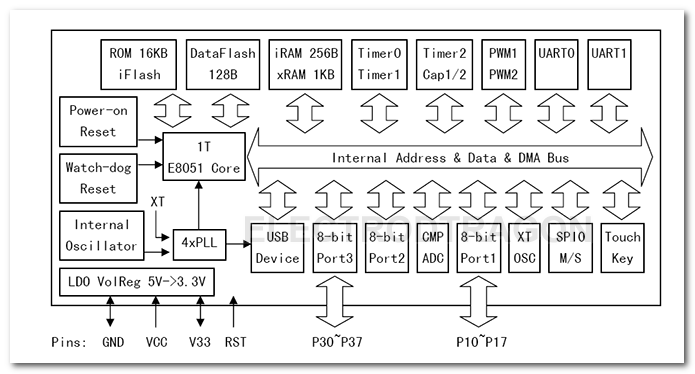
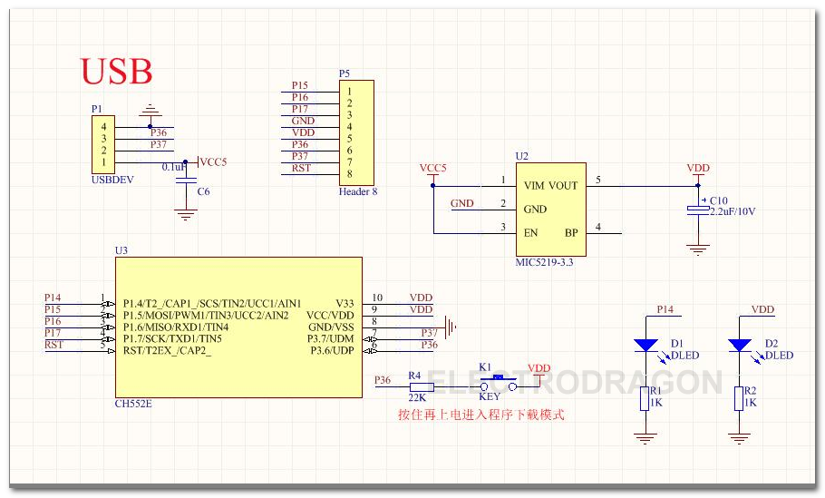
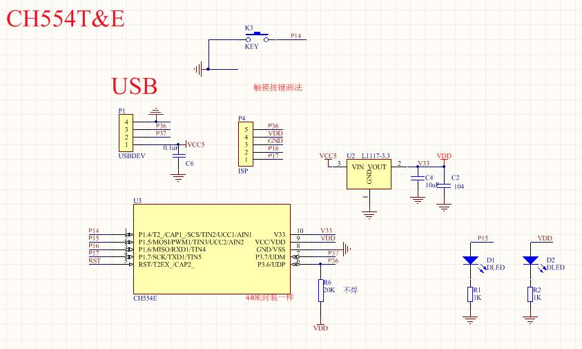
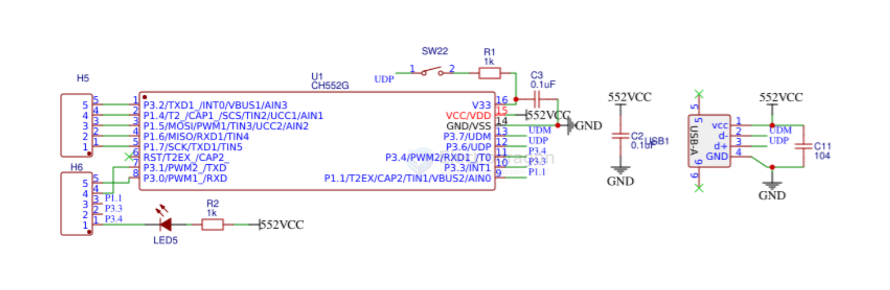
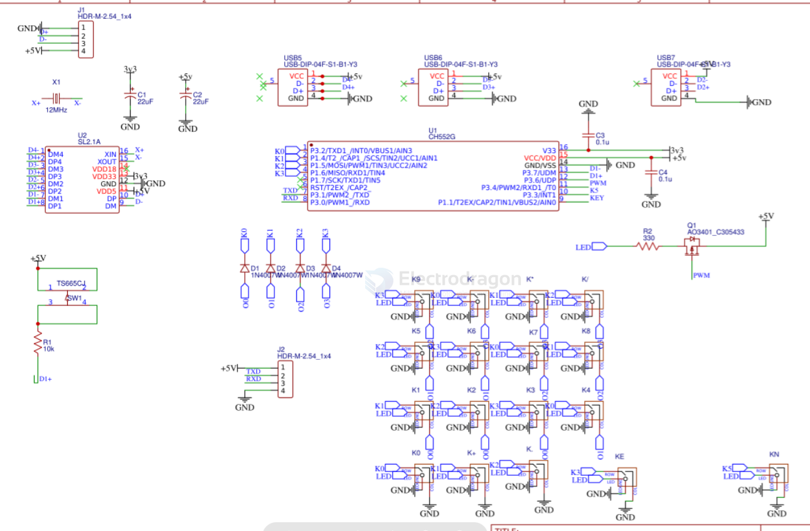
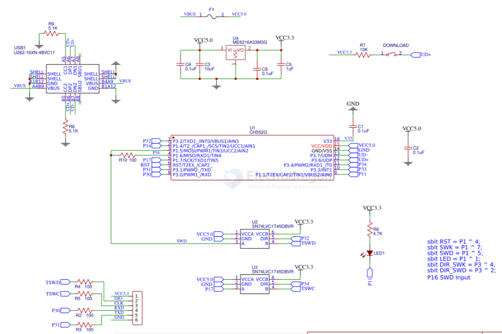
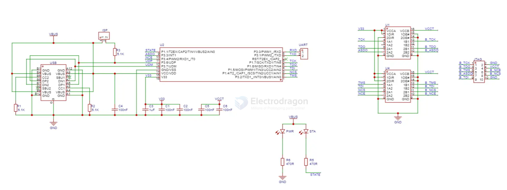
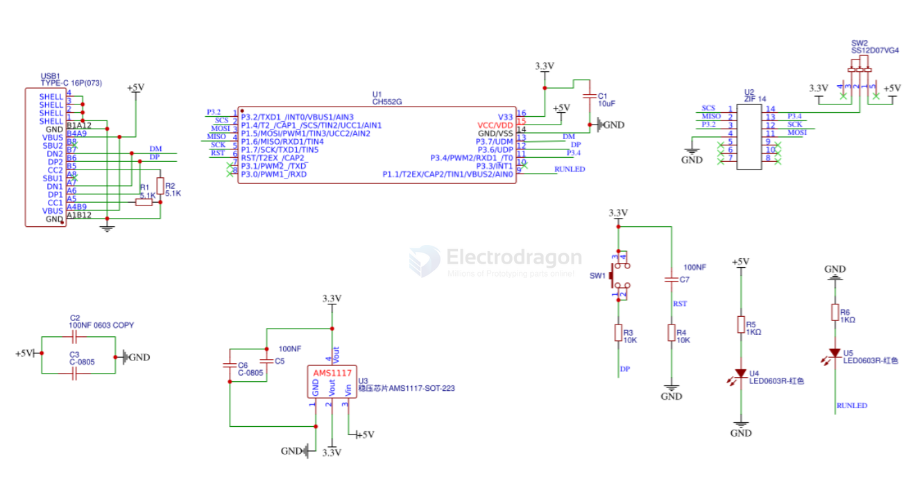
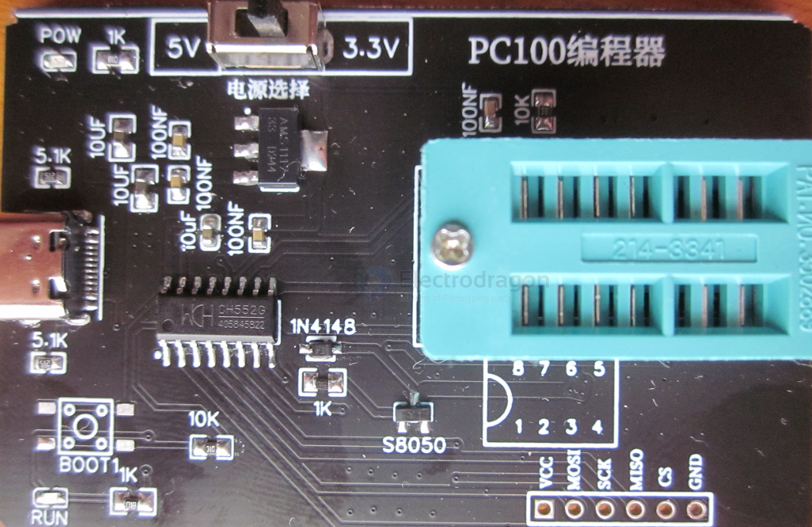
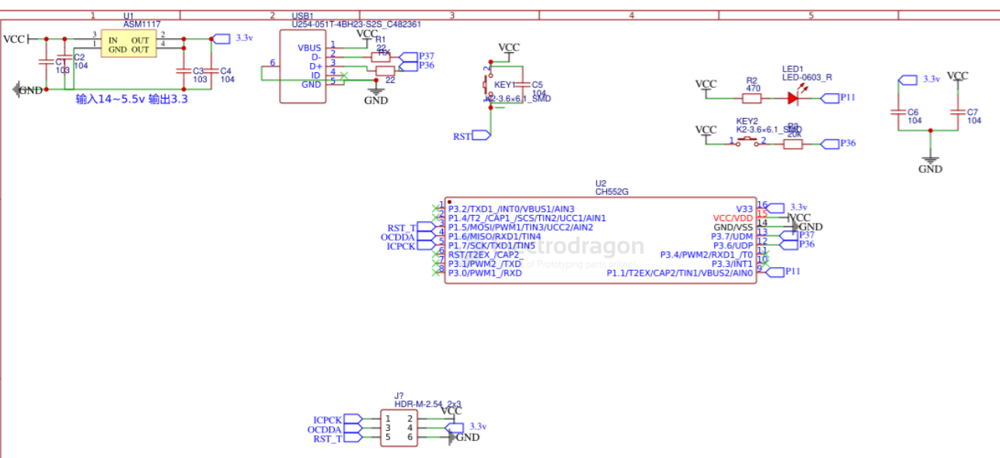

# CH552-dat

- [[WCH-MCU-dat]]

## CH552 SCH 

## keyboard and touchpad

- [[interactive-dat]] - [[USB-hub-dat]] - [[keypad-dat]]

## DAPLINK 

- [[DAPLINK-dat]]

## USB Blaster 

https://github.com/xjtuecho/CH552Nano/tree/main/FW

SN74AVC4T245PWRE4

- [[USB-Blaster-dat]] - [[FPGA-dat]]

## EZP2019 

The EZP2019 is a popular, high-speed USB SPI programmer used for reading and writing BIOS/firmware chips in electronics like TVs, DVDs, and computers, supporting common 24, 25, and 93 series EEPROM/Flash memory, featuring fast USB 2.0 speeds, automatic chip detection, and offline copy functions, making it a versatile tool for appliance repair and electronics hobbyists. 

- [[ezp2019-2.zip]] - [[ezp2019-1.bin]] - [[USB-dat]] - [[USB-SPI-dat]]

## USBASP 

- [[USBASP-dat]]

## programmer 

- [[PRGMR-PC100.rar]]

## N76E003 ICP programmer 

- [[ICP-dat]]

## sound detection 

- [[sound-dat]] - [[audio-dat]] - [[voice-detection-dat]]

## ref 

- [[CH55x-dat]]

- [[CH551-dat]] - [[CH552-dat]] - [[CH554-dat]] - [[CH559-dat]]