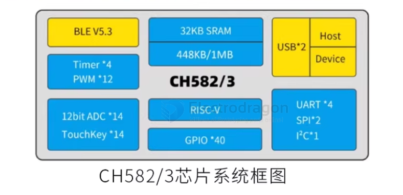
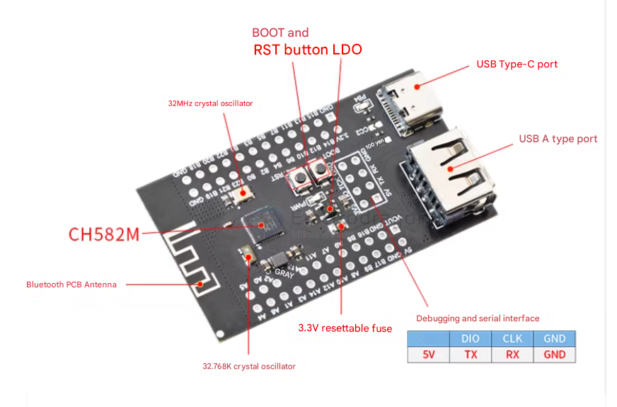

# CH582-dat

BLE5.3 60MHz RAM:32KB ROM:448KB

产品特点

32位RISC处理器

支持RV32IMAC指令集，支持硬件乘法和除法32KBSRAM，512KBFLASH，支持ICP、ISP和IAP，支持OTA无线升级内置2.4GHZRF收发器和基带及链路控制支持BLE5.3支持2MBPS、1MBPS、500KBPS.125KBPS接收灵敏-98DBM可编程+7DBM发送功率提供协议栈和应用层API

- 内置温度传感器
- 内置RTC，支持定时和触发两种模式提供2组USB2.0全速HOST/DEVICE提供14通道触摸按键
- 提供14通道12位ADC
- 提供4组UART，2组SPI，12路PWM，1路IIC40个GPIO，其中4个支持5V信号输入
- 最低支持1.7V电源电压
- 内置AES-128加解密单元，芯片唯一ID

芯片概述

CH582/3是集成BLE无线通讯的32位RISC微控制器。片上集成2MBPS低功耗蓝牙BLE通讯模块、2个全速USB主机和设备控制器及收发器、2个SPI、4个串口、ADC、触摸按键检测模块、RTC等丰富的外设资源。

- [[WCH-SDK-dat]]

## ref 

- [[wch-dat]]