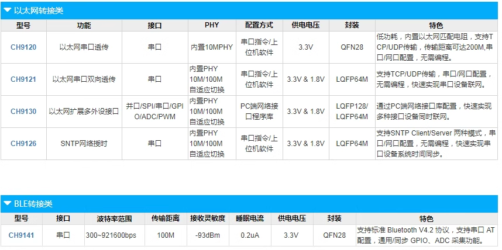

# CH9121-dat

- [[ethernet-dat]]

http://www.wch-ic.com/products/CH9121.html

Features
- Built-in Ethernet MAC and PHY.
- Two-way penetrate transparent of serial data and network data.
- Supports 10 / 100M, full duplex / half duplex adaptive Ethernet interface, fully compatible with IEEE 802.3 protocol.
- Auto MDI/MDIX switching.
- Supports 3 kinds of work mode: TCP-Client, TCP-Server and UDP.
- Supports serial baud rate from 300bps to 921600bps.
- TTL logic level, compatible with 3.3V and 5V.
- Serial port supports both full duplex and half duplex, supports RS485 auto direction control.
- Work mode, port, Ethernet configurations can be set by host PC software.
- Virtual Serial Port Supported.

## ref 

- [[CH9121]]