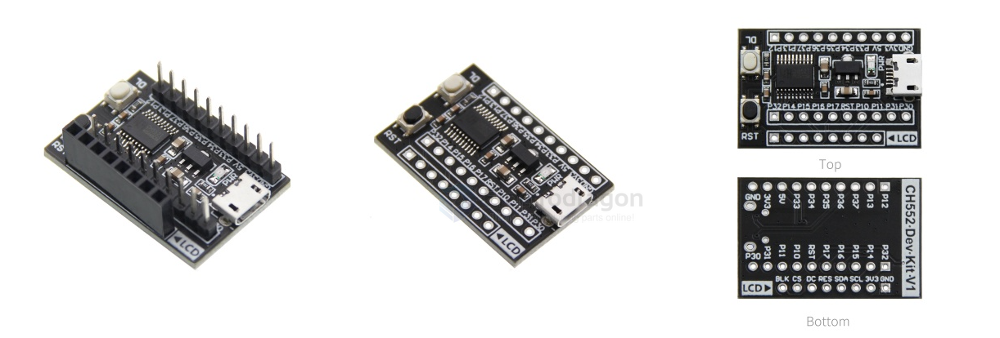
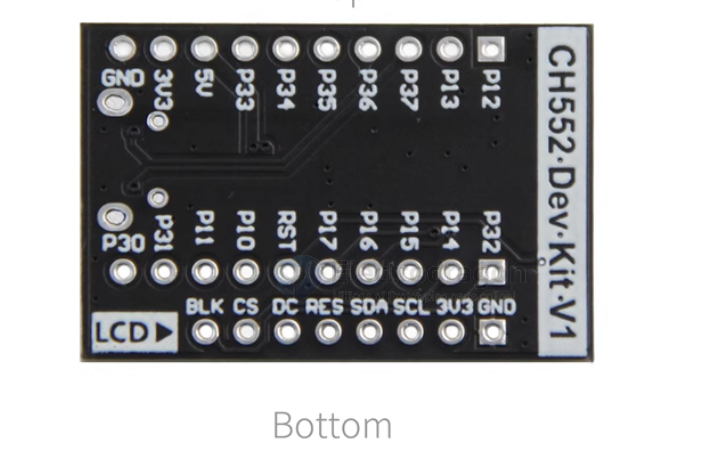

# WCH-APP

## SPI LCD Test board 

## Product Features

- **CPU:** CH552T
- **Main Frequency:** 16MHz
- **Internal FLASH:** 16KB
- **Internal SRAM:** 256B

### Advantages

- Rich development resources
- Simple and easy to learn, beginner-friendly
- Compact and elegant appearance, suitable for various DIY projects

### Connectivity & Expansion

- Supports USB and serial download for convenient debugging
- Direct plug-in support for SPI and IIC display modules
- Expandable GPIO ports for connecting various peripherals

### Documentation

- Comprehensive development materials provided

## Demo Code Overview

1. **Demo_CH552_Project_Template**  
   - This is a project template program without any peripheral code. Use it as a base to create your own project.

2. **IPS Screen Example Codes (8 Sizes Available)**  
   - For each IPS screen size, there are four demo examples:
     - **A. Demo_CH552_Clear_Screen**  
       Demonstrates solid color fill. Displays five colors: black, white, red, green, and blue.
     - **B. Demo_CH552_Show_Font**  
       Demonstrates text and symbol display. Shows Chinese, English, numbers, and symbols.
     - **C. Demo_CH552_Show_Graph**  
       Demonstrates graphics display. Shows lines, dots, rectangles, circles, triangles, and black-and-white checkerboard patterns.
     - **D. Demo_CH552_Show_Picture**  
       Demonstrates image display. Shows a full-screen 40x40 pixel image.

3. **HEX File Directory**  
   - Contains compiled HEX files for all 8 IPS screen sizes.  
   - No need to search for HEX files in the example projects; simply use USB or serial to download the HEX files from this directory.  
   - For detailed download instructions, refer to the documentation in the "Download Methods" folder of the resource

## ref 

- [[display-dat]] - [[WCH-dat]]