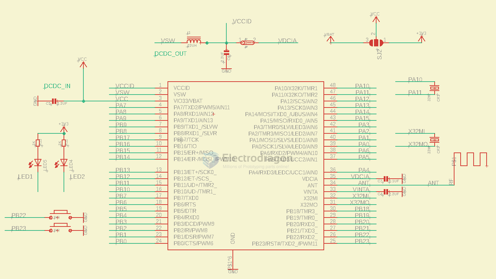

# CH579-dat

## Power supply 

- VSW - 内部DC-DC 开关输出，启用DC-DC 时必须贴近引脚串接22uH或33uH 电感连接到VDCID，不启用DC-DC 时可以直连VDCID。
- VCCID - 内部数字电路LDO 调整器的电源输入，需外接退耦电容。 启用DC-DC 时建议2.2uF，不启用时建议不小于0.1uF。 
- VIO33 - I/O 和DC-DC 或电池电源输入，需贴近引脚外接退耦电容。 启用DC-DC 时建议2.2uF，不启用DC-DC 时建议不小于1uF。 

Analog Power Supply
- VDCIA - 内部模拟电路 LDO 调整器的电源输入，需外接退耦电容。建议不小于 0.1uF，建议直连 VDCID。
- VINTA - 内部模拟电路的电源节点，需贴近引脚外接退耦电容，建议2.2uF（未用 DC-DC 时可选 1uF，略省电但降低 BLE 灵敏度）。

### optional 

- VIO - I/O电源输入，需贴近引脚外接退耦电容，建议不小于0.1uF。

## boards 

- [[ARM1003-dat]] - [[ethernet-dat]] - [[usb-dat]] - [[CH57x-dat]]

- [[CH579]]