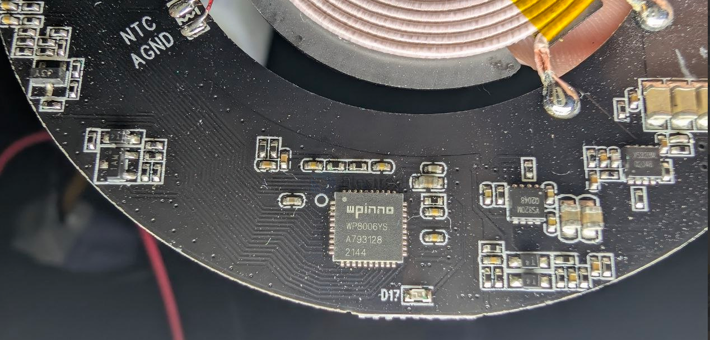
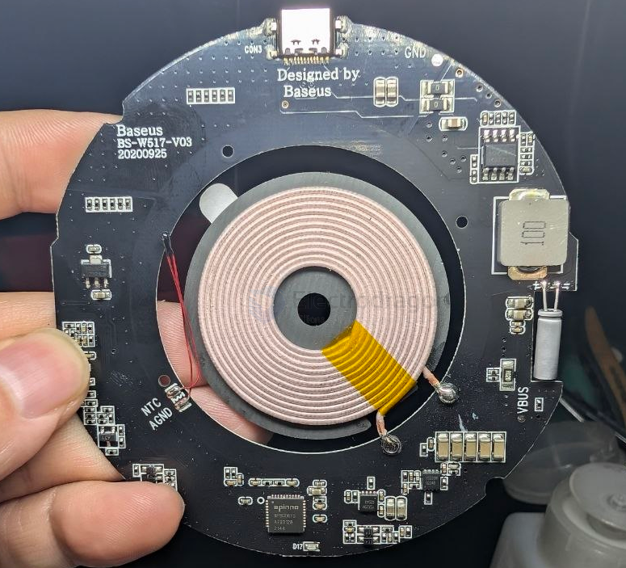
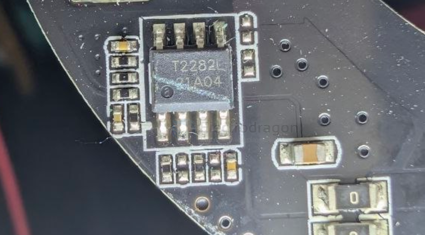

# WPINNO-dat

- [[WPINNO-dat]] - [[WP8006-dat]] - [[WP9005-dat]] - [[power-wireless-dat]]

## WY8006

## build 

YS320M Q2048 == unknown mosfet ? 

- [[TMI-dat]] - [[T2282-dat]] == [[dcdc-down-dat]] == 30V 2.7A - [[WPINNO-dat]]

- [[LDO-dat]]

## ref 