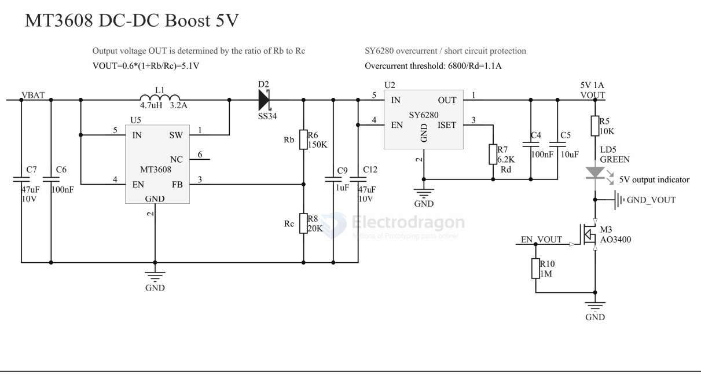

# MT3608-dat.md

## boards 

- [[OPM1089-dat]]

## info 

MT3608-datasheet == [[XI-AN-Aerosemi-Tech-MT3608.pdf]]

## MT3608 

High Efficiency 1.2MHz 2A Step Up Converter

FEATURES

- · Integrated 80mQ Power MOSFET
- · 2V to 24V Input Voltage
- · 1.2MHz Fixed Switching Frequency
- · Internal 4A Switch Current Limit
- · Adjustable Output Voltage
- · Internal Compensation
- · Up to 28V Output Voltage
- · Automatic Pulse Frequency Modulation Mode at Light Loads
- · up to 97% Efficiency
- · Available in a 6-Pin SOT23-6 Package

## SCH 

- [[SY6280-dat]] - [[silergy-dat]]