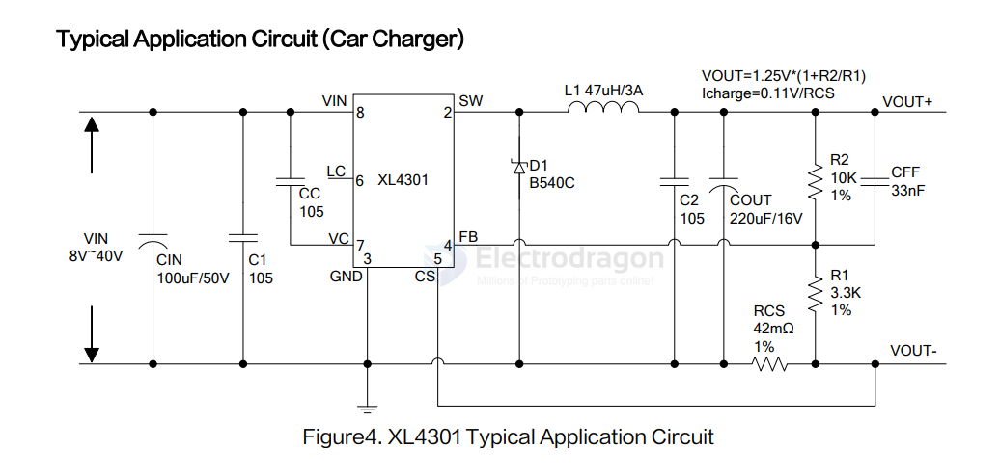

# XL-dat 

- [[XL-dat]] - [[dcdc-down-dat]] - [[dcdc-boost-dat]] - [[LDO-dat]]

### DC-DC Bulk 

- [[XL4015-dat]] 

- [[XL4301-dat]] - 3A 180KHz 45V Buck DC/DC Converter With Constant Current Loop 

### DC-DC Boost 

* XL6008

- XL7304 ? 
- XL3429 ? 

## XL4005

## dcdc down 

- [[XL1509-dat]] - [[XL7015-dat]]

### XL3163 

- [[XL3163-dat]] - [[XL-dat]] - [[dcdc-down-dat]] - [[solar-dat]] - [[CV&CC-dat]]

Lithium Ion Battery Charger for Solar-Powered Systems - CN3163

The CN3163 is a complete constant-current /constant voltage linear charger for single cell Li-ion and Li Polymer batteries. 

he device contains an on-chip power MOSFET and eliminates the need for the external sense resistor and blocking diode. 

An on-chip adaptive cell can adjust charging current automatically based on the output capability of input power supply, so CN3163 is ideally suited for solar powered system. 

Thermal feedback regulates the charge current to limit the die temperature during high power operation or high ambient temperature. 

The regulation voltage is internally fixed at 4.2V with 1% accuracy, it can also be adjusted upwards with an external resistor. 

The charge current can be set externally with a single resistor. When the input supply is removed, the CN3163 automatically enters a low power sleep mode , dropping the battery drain current to less than 3uA. Other features include undervoltage lockout, automatic recharge, battery temperature sensing and charging/termination indicator.

The CN3163 is available in a thermally enhanced 8-pin SOP package. 

