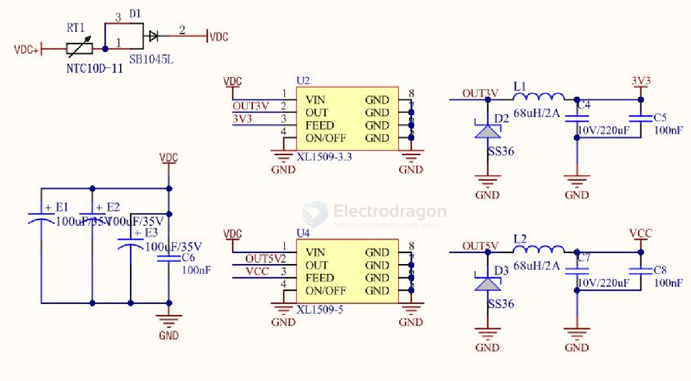

# XL1509-dat

[XL1509 == 2A 150KHz 40V Buck DC to DC Converter](https://www.xlsemi.com/datasheet/XL1509-EN.pdf)

VDC to VCC and 3.3V 

- [[SB1045-dat]]

- [[power-protection-dat]]

- [[dcdc-down-dat]] 

## XL1509

- Wide 4.75 to 40V Input Voltage Range
- 3.3V,5V,12V, and adjustable versions
- Output Adjustable from 1.23V to 38V

## ref 

- [[XL-dat]]