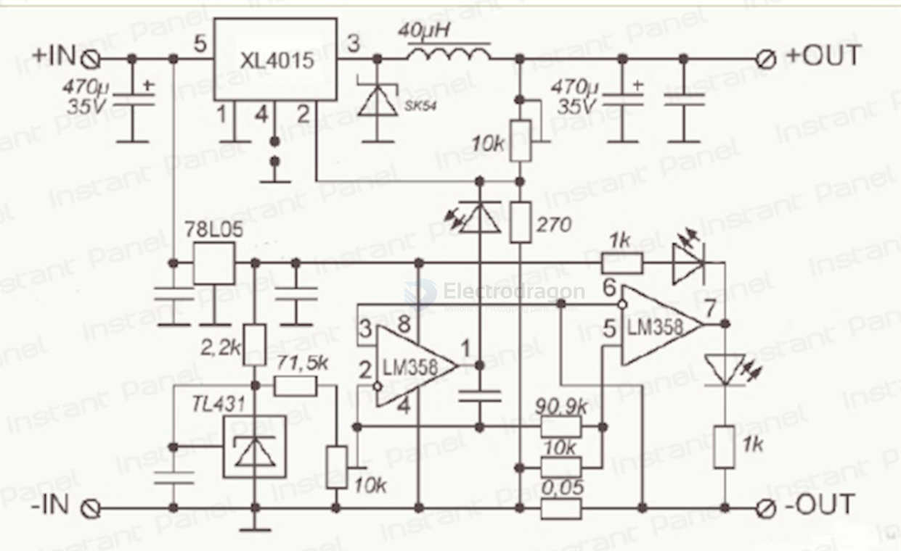

# XL4015-dat 

- 5A 180KHz 36V Buck DC to DC Converter 

5A Constant Output Current Capability

Built in current limit function 

- [[XL4015_datasheet.pdf]]

## Boards 

- [[OPM1085-dat]]

## SCH

Constant Current and Voltage XL4015 5A Step Down Module

## ref 

- [[XL-dat]]