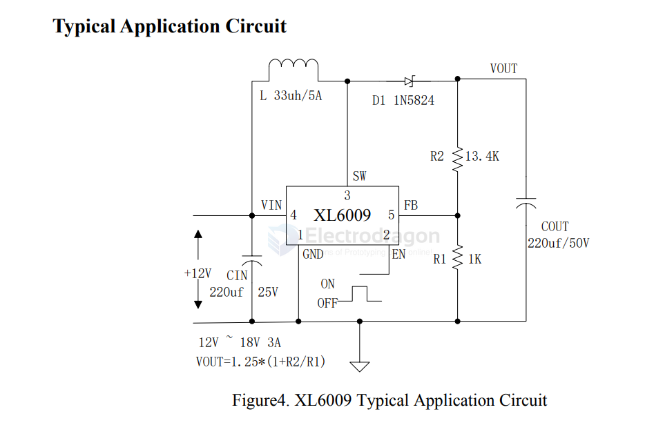

# XL6009-dat

- [[OPM1009-dat]] - [[OPM1019-dat]] - [[dcdc-boost-dat]] - [[XL-dat]]

The XL6009 regulator is fixed frequency PWM Boost (step-up) DC/DC converter, capable of driving 5A switching current with excellent line and load regulation. The regulator is simple to use because it includes internal frequency compensation and a fixed-frequency oscillator so that it requires a minimum number of external components to work. 

Features
- „ Wide 3.6V to 36V Input Voltage Range
- „ 1.25V reference adjustable version
- „ Fixed 400KHz Switching Frequency
- „ Maximum 5A Switching Current
- „ SW PIN Built in Over Voltage Protection
- „ Excellent line and load regulation
- „ EN PIN TTL shutdown capability
- „ Internal Optimize Power MOSFET
- „ High efficiency
- „ Built in Frequency Compensation
- „ Built in Thermal Shutdown Function
- „ Built in Current Limit Function
- „ Available in SOP8 package

## SCH 

## ref 

- [[XL-dat]]