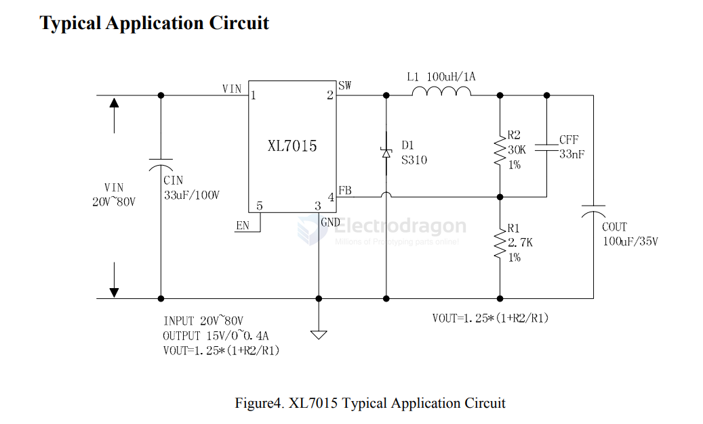

# XL7015-dat

### XL7005 - 0.4A 150KHz 100V Buck DC to DC Converter

https://www.xlsemi.com/datasheet/XL7005A-EN.pdf

Features

-  Operating Voltage: 5V~80V
-  Output Adjustable from 1.25V to 20V
-  Maximum Duty Cycle 90%
-  Minimum Drop Out 2V
-  Fixed 150KHz Switching Frequency
-  Maximum 0.4A Output Current
-  Recommend output power less than 5W
-  Internal Optimize HV Power Transistor
-  High efficiency up to 85%
-  Excellent line and load regulation
-  TTL shutdown capability
-  Built in thermal shutdown function
-  Built in output short Protection Function
-  Built in current limit function
-  SOP8-EP (Exposed PAD) package

- 47UH or 100UH 1A 
- 33UF/100V 
- 100UF/35V
- S310 
- 30K / 2.7K 
- 33NF 

- [[resistor-feedback-dat]] - [[resistor-dat]]

## ref 

- [[XL-dat]] - [[dcdc-down-dat]] - [[dcdc-boost-dat]]

