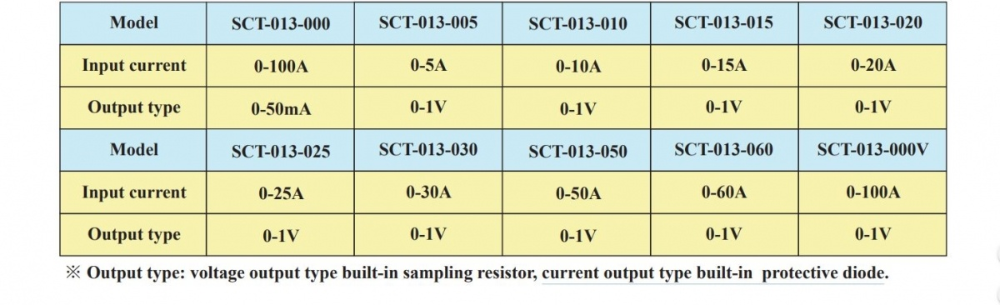
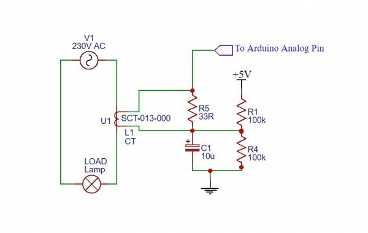
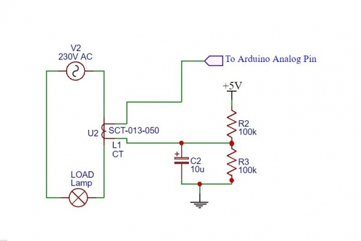

# YHDC-dat

- arduino shield - [[DAS1010-dat]]

## SCT Split Core Current Transformer

- [[SVC1010-dat]] - [[SVC1008-dat]]

| Brand | Model Number | Input Current (RMS) | Turn Ratio | Output Type    | Output Value                                 | Notes                                        |
| :---- | :----------- | :------------------ | :--------- | :------------- | :------------------------------------------- | :------------------------------------------- |
| YHDC  | SCT-013-000  | 0∼100A              | 100A:0.05A | Current Output | 0-50mA                                       | Current output Type with built-in protective diode |
| YHDC  | SCT-013-030  | 0∼30A               | N/A        | Voltage Output | 1 V                                          | Across built-in sampling resistor            |
| YHDC  | SCT-013-050  | 0∼50A               | N/A        | Voltage Output | 1 V                                          | Across built-in sampling resistor            |

- Accuracy: ±1%
- Linearity: ≥ 0.2%
- Weight: 50g
- Core Material: Ferrite
- External Material: ABS Plastic
- Dielectric Strength VAC/1min:6 kV
- Work voltage: 660V
- Open Size:13mm×13mm
- Frequency: 50Hz to 1 kHz

SCT013 Models

**STC 013 000 Arduino Interfacing**

STC-013-000 modules come without Sampling resistor, it provide current output proportionally to Input current. To convert current into voltage R5 (burden resistor) 18Ω to 33Ω must be added across CT terminal. - [[burden-resistor-dat]] - [[resistor-dat]]

**STC 013 050 Arduino Interfacing**

All the remaining module in STC-013 series comes with Inbuilt burden resistor. No need to add externally.

## code 

[“EmonLib.h”](https://github.com/openenergymonitor/EmonLib) 

https://github.com/openenergymonitor/EmonLib/blob/master/examples/current_only/current_only.ino

Electricity monitoring library designed by https://openenergymonitor.org is best for voltage and current measurement usign Arduino Code.

    #include “EmonLib.h” // Include Emon Library

    EnergyMonitor emon1; // Create an instance

    void setup()
    {
        Serial.begin(9600);
        emon1.current(1, 111.1); // Current: input pin, calibration.
    }

    void loop()
    {
        double Irms = emon1.calcIrms(1480); // Calculate Irms only
        Serial.print(Irms*230.0); // Apparent power
        Serial.print(” “);
        Serial.println(Irms); // Irms
    }

## ref 

