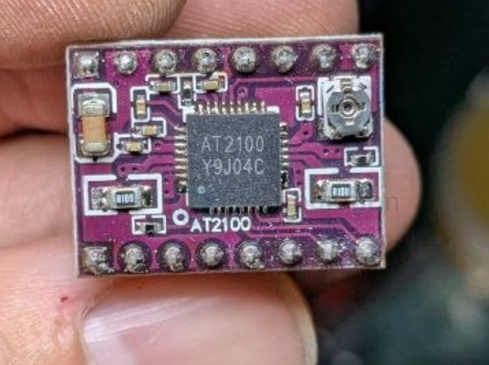

# AT2100-dat

- [[AT2100_Datasheet_CN_V0.1.pdf]]

AT2100 是一款内部集成了译码器的智能步进电机驱动芯片。它主要用于通过简单的脉冲输入来控制步进电机，常被广泛应用于3D打印机、医疗仪器、安防监控云台以及各类小型自动化设备中。

核心参数与特性驱动能力：

- 最大输出驱动能力达到 \(32\text{V} / \pm2.5\text{A}\)。
- 细分支持：最高支持 16 细分，并支持 256 插补细分功能。
- 静音技术：支持电压衰减模式，可使电机处于完全静音的工作状态，轨迹平滑。
- 内部电流检测：可工作在内部电流检测模式，省去外部两个检流电阻，有效节省 PCB 面积和物料成本。
- 智能省电：支持自动半流锁定功能，无脉冲输入时自动将输出电流减半，降低系统功耗。
- 接口简便：采用 STEP/DIR（脉冲/方向）控制接口，输入一个脉冲即可使电机完成一次步进，省去了复杂的相序表与编程接口。

AT2100是一种便于使用的内部集成了译码器的智能步进电机驱动器。其输出驱动能力达到32V ±2.5A，最高支持16细分，同时支持插补细分工作功能。AT2100支持电压衰减，使其完全静音工作，同时支持混合电流衰减，提供高扭矩输出。译码器是AT2100易于实施的关键。通过STEP简单的输入一个脉冲就可以使电机完成一次步进，省去了相序表，高频控制线及复杂的编程接口。这使其更适于在没有复杂的微处理器或微处理器负担过重的场合。

AT2100支持电压衰减模式，配合256自动插细分，使电机处于完全静音的工作模式，达到平滑的运动轨迹，即使是以整步运行。AT2100可工作在内部电流检测模式，省去外部两个检流电阻，节省PCB面积和元器件成本。同时，AT2100支持自动半流锁定功能，在无STEP变化时，自动减半输出电流，降低系统锁定功耗。同步整流控制电路改善了PWM操作时的功耗。内部保护电路包括：带迟滞额过热保护、欠压锁定及过流保护。

AT2100目前提供带有裸露焊盘的QFN-36封装，能有效改善散热性能，且是无铅产品，引脚框采用100％无锡电镀。

型号封装包装信息
AT2100     QFN36
特点
●两相四线双极步进电机驱动
●低导通电阻RDS(ON) ，2.5A峰值电流输出
●简单的STEP/DIR接口，最高支持16细分
●支持插细分功能，自动插补到256细分
●支持电压衰减，超静音工作，更圆滑运动
●支持混合电流衰减，高扭矩输出
●支持内置电流检测功能，省去外部检流电阻
●支持半流锁定功能
●兼容3.3V和5V逻辑电平
●过热关断功能
●输出过流保护功能
封装形式QFN36 with exposed thermal pad
应用
●打印机、扫描仪等自动化办公设备
●3D打印机
●游戏机、机器人、医疗设备
●安防、ATM