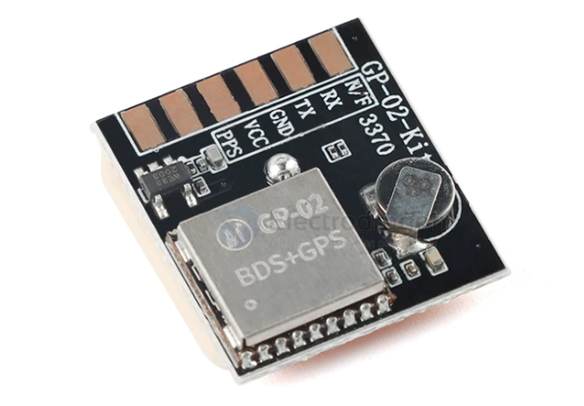
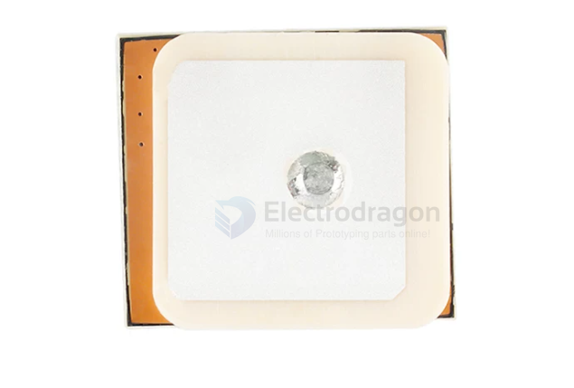
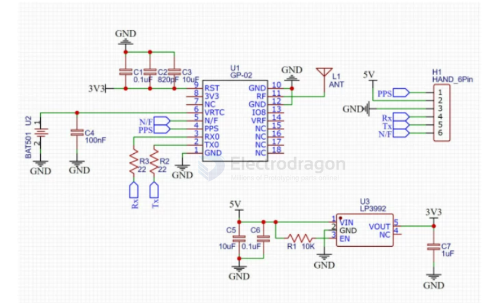
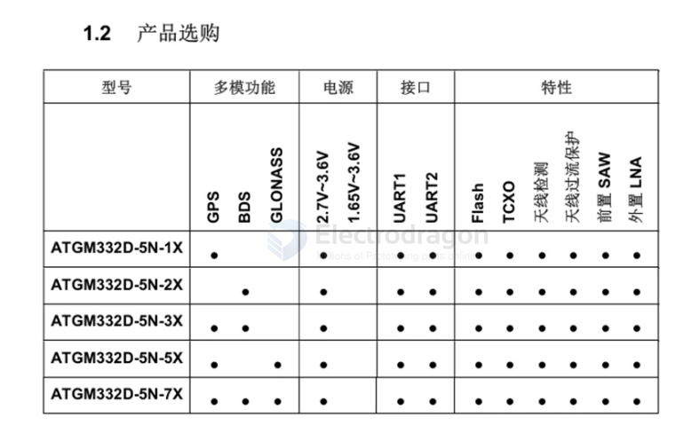
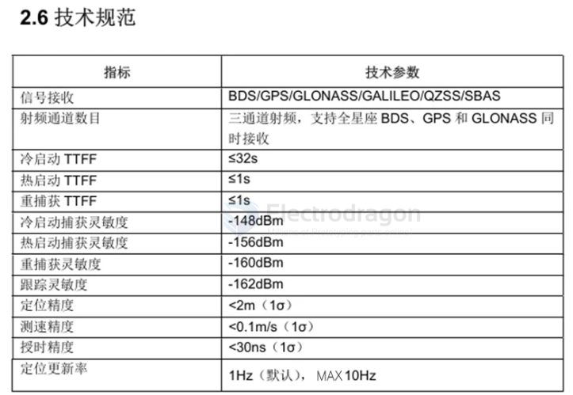

# AT6558-dat

- [[location-dat]] - [[AT6558-dat]] - [[zhongkewei-dat]]

GP-02-Kit是一款高集成带有陶瓷天线、高性能BDS/GNSS多模卫星导航接收机SOS开发板，主芯片为AT6558R卫星定位芯片。集成了射频前端，数字基带处理器，32位的RISCCPU，电源管理和有源天线检测与保护功能。支持多种卫星导航系统，包括北斗卫星导航系统BDS/GPS/GLONASS,可实现多系统联合定位。该开发板遵循NMEA协议，通过串口通讯发送指令来控制开发板的工作内容。

## SCH 

## ATGM332D

ATGM332D-5N系列模块是12X16尺寸的高性能BDS/GNSS全星座定位导航模块系列的总称。该系列模块产品都是基于中科微第四代低功耗GNSSSOC单芯片一AT6558，支持多种卫星导航系统，包括中国的BDS(北斗卫星导航系统)，美国的GPS，俄罗斯的GLONASS，欧盟的GALILEO，日本的QZSS以及卫星增强系统SBAS(WAAS，EGNOS,GAGAN，MSAS)。

AT6558是一款真正意义的六合一多模卫星导航定位芯片，包含32个跟踪通道，可以同时接收六个卫星导航系统的GNSS信号，并且实现联合定位、导航与授时。ATGM332D-5N系列模块具有高灵敏度、低功耗、低成本等优势，适用于车载导航、手持定位、可穿戴设备，可以直接替换UbloxNEO系列模块。

## specs 

## ref 