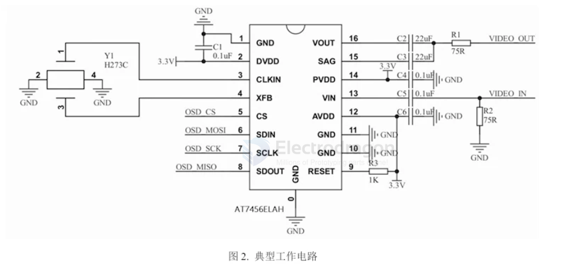
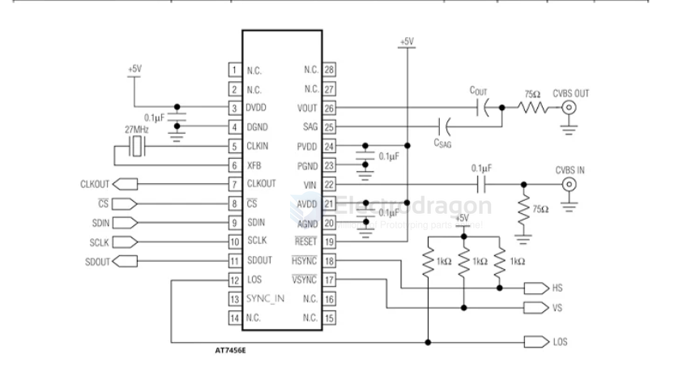

# ZHONGKEWEI-dat

- [[zhongkewei-dat]] - [[motor-driver-dat]]

## motor driver 

AT8549 SSOP-10双通道H桥电机驱动芯片直流有刷电机/步进

AT8548 SSOP-10 双通道H桥电机驱动芯片 直流有刷电机/步

AT8222 ESOP-8 单通道直流有刷电机驱动芯片

中科微马达驱动芯片：ATD5984 ATD5995 AT5989 AT5999 AT2100 AT2130 AT5130  AT8833 AT8549 AT8211E AT8637 AT1106

- [[AT8236-dat]] - [[AT8837-dat]] - [[AT8870-dat]]

AT8837 UDFN-8 低压H桥电机驱动芯片 直流有刷电机驱动芯片 

AT8870 SOP-8 单通道直流有刷电机驱动芯片

AT8833CQ QFN-16 双通道H桥电机驱动芯片 直流有刷电机/双极

AT8236 ESOP-8 电机驱动芯片有刷直流电机驱动H桥驱动

## stepper 

原装ATD5984 QFN-24内置转换器和过流保护的微特步进电机驱动芯片

AT2100 是一款内部集成了译码器的智能步进电机驱动芯片。它主要用于通过简单的脉冲输入来控制步进电机，常被广泛应用于3D打印机、医疗仪器、安防监控云台以及各类小型自动化设备中。核心参数与特性驱动能力：最大输出驱动能力达到 \(32\text{V} / \pm2.5\text{A}\)。细分支持：最高支持 16 细分，并支持 256 插补细分功能。静音技术：支持电压衰减模式，可使电机处于完全静音的工作状态，轨迹平滑。内部电流检测：可工作在内部电流检测模式，省去外部两个检流电阻，有效节省 PCB 面积和物料成本。智能省电：支持自动半流锁定功能，无脉冲输入时自动将输出电流减半，降低系统功耗。接口简便：采用 STEP/DIR（脉冲/方向）控制接口，输入一个脉冲即可使电机完成一次步进，省去了复杂的相序表与编程接口。

- [[motor-stepper-driver-dat]]

## GPS 

- [[ZHONGKEWEI-dat]] - [[ATGM336H-dat]] - [[NGS1078-dat]]

- [[AT2100-dat]]

中科微LNA芯片：ATR2037 ATR2092 ATR2031 ATR2032 ATR2034 ATR2035 AT6558 AT6558 AT6558D  AT6558D AT6558E AT6558E
中科微卫星定位模块：ATGM331C-5N ATGM332D-5N ATGM332D-5N ATGM332D-5N ATGM336H-5N ATGM336H-5N ATGM332D-5L ATGM332D-5S

中科微前端射频模组芯片：AT2401C AT2402E
中科微定位芯片: AT6558 AT6558 AT6558D AT6558D AT6558E AT6558E AT6558R

## RF gain 

- [[AT2659-dat]] - [[ATR2037-dat]] - [[zhongkewei-dat]] - [[ATR2652-dat]] - [[amplifier-GNSS-dat]]

ATR2652 DFN-6 GNSS全频段高增益低噪声放大器芯片

- [[amplifier-dat]] - [[amplifier-GNSS-dat]] - [[zhongkewei-dat]]
 

## display 

- [[display-driver-dat]] - [[OSD-driver-dat]] - [[zhongkewei-dat]] - [[OSD-dat]]

AT7456ELAH LGA-16 集成EEPROM单通道单色随屏显示发生器芯片 == 集成了EEPROM的 单通道、单色随屏显示器

AT7456E TSSOP-28集成了EEPROM单通道单色随屏显示发生器芯片

## rf

- [[zigbee-dat]] - [[zhongkewei-dat]]

AT2401C QFN-16 2.4GHz Zigbee 射频前端芯片

## ref 

