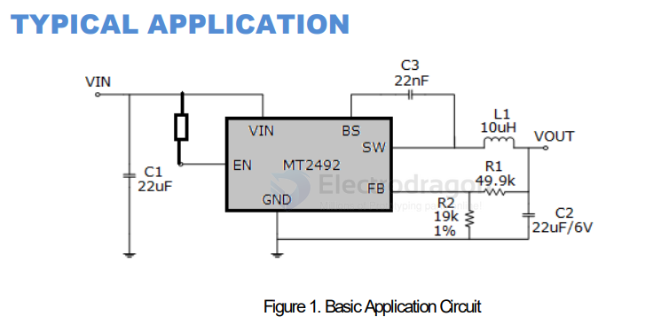

# MT2492-dat

- A6164P - [[MT2492-dat]] - [[aerosemi-dat]] - [[IP2326-dat]]

2A High-Efficiency Synchronous Step-Down Converter

MT2492

Aerosemi Technology Co., Ltd 1

600KHz, 16V，2A Synchronous Step-Down Converter

FEATURES
-  High Efficiency: Up to 96%
-  600KHz Frequency Operation
-  2A Output Current
-  No Schottky Diode Required
-  4.5V to 16V Input Voltage Range
-  0.6V Reference
-  Slope Compensated Current Mode Control for Excellent Line and Load Transient Response
-  Integrated internal compensation
-  Stable with Low ESR Ceramic Output Capacitors
-  Over Current Protection with Hiccup-Mode
-  Thermal Shutdown
-  Inrush Current Limit and Soft Start
-  Available in SOT23-6 Package
-  -40°C to +85°C Temperature Range

## ref 

