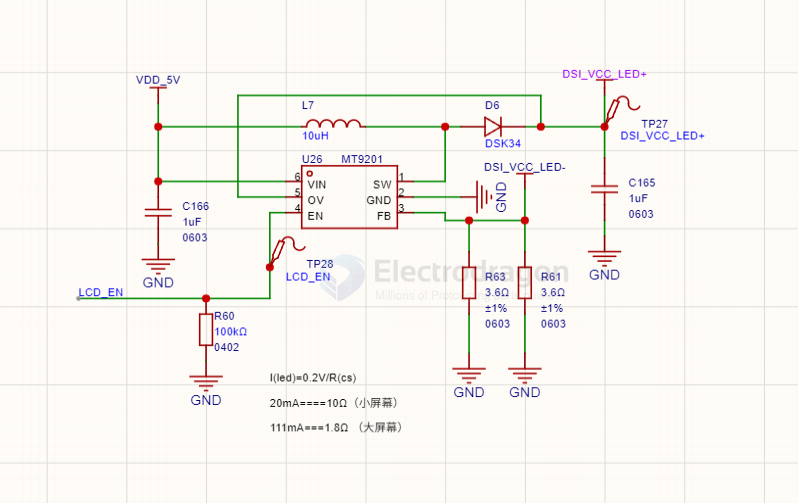

# MT9201-dat

- [[MT9201-dat]] - [[LED-driver-dat]] - [[aerosemi-dat]]

- [[MT9201-dat]] == 
-40℃~+85℃ 1 1.2MHz 20mA 3V~24V Analog、PWM Boost Built-in Under Voltage Protection、Over Voltage Protection、Over Current Protection、Over-Temperature Protection (OTP) SOT-23-6 LED Drivers ROHS 

The MT9201 is a step-up converter designed for driving up to 7 series white LEDs from a single cell Lithium Ion battery. The MT9201 uses current mode, fixed frequency architecture to regulate an LED current, which is measured through an external current sense resistor. Its low 200mV feedback voltage reduces power loss and improves efficiency. 

## ref

