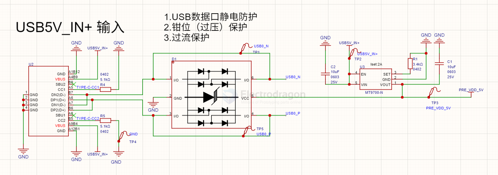
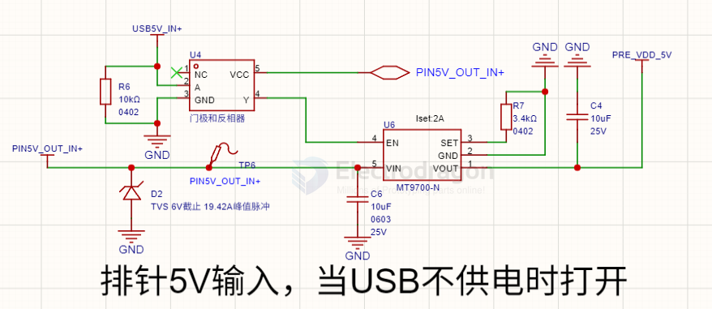
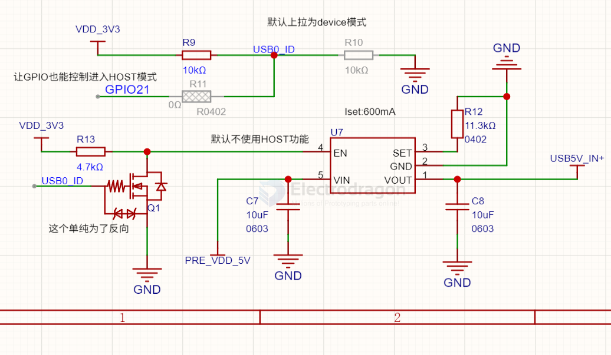
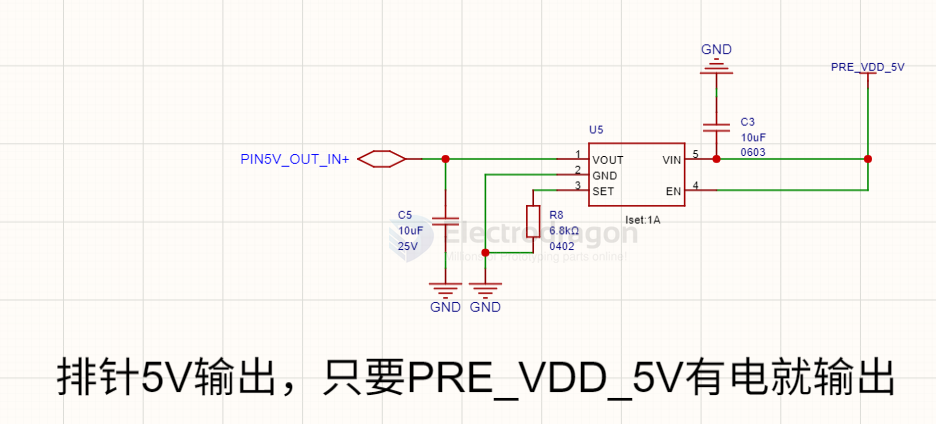

# MT9700-dat

- [[K230D-dat]]

## MT9700

- [[aerosemi-dat]] - [[MT9700-dat]] - [[power-limit-dat]] - [[power-dat]]

3 -- SET -- External resistor used to set current-limit threshold

80mΩ, Adjustable Fast Response Current-Limited Power-Distribution Switch

The MT9700 is a cost-effective, low voltage,singleP-MOSFET load switch,optimized for self-poweredand bus-powered Universal Serial Bus(USB)applications. 

This switch operates with inputsranging from 2.4V to 5.5V, making it ideal for both3V and 5V systems. The switch's low Rps(oN),80mΩ ,meets USB voltage drop requirements. 

TheMT9700 is also protected from thermal overloadwhich limits power dissipation and junctiontemperatures.

Currentlimitthresholdisprogrammed with a resistor from SET to ground.

The quiescent supply current is typically 15μA atswitch on state. At switch off state the supplycurrent decreases to less than 1μA.The MT9700 isavailable in SOT23-5 package.

### build 

SCH 1 

SCH 2 

SCH 3 

SCH 4 

## ref 

