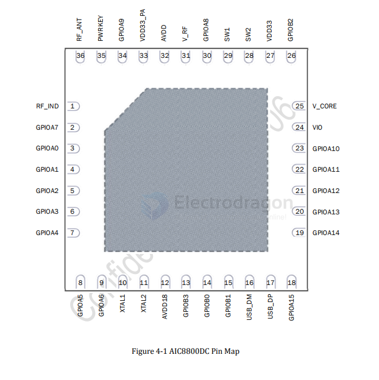

# aicsemi-dat.md

- [[AIC8800-dat]] - [[aicsemi-dat]] - [[wifi-dat]] - [[sdio-dat]] - [[USB-SDK-dat]]

- [[AIC8800-dat]] - [[aicsemi-dat]] - [[wifi-6-dat]] - [[BT5.2-dat]]

The `AIC8800` is a highly integrated Wi-Fi 6 (802.11ax) and Bluetooth wireless chip developed by Aicsemi (爱科微电子). 

It supports dual-band operations (2.4GHz and 5GHz) and is widely used in budget-friendly USB Wi-Fi adapters, development boards (like Radxa and Pine64), and embedded hardware ([[Rockchip-dat]], [[Allwinner-dat]]).

## ref 

