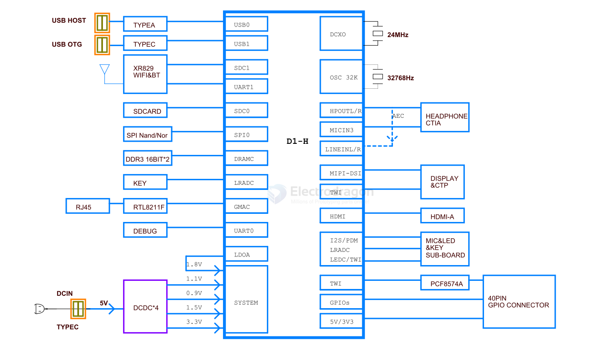

# D1-H-dat

D1-H 是全志科技首款基于RISC-V指令集的芯片，集成了阿里平头哥64位C906核心，支持RVV，1GHz+主频，可支持Linux、RTOS等系统。同时支持最高4K的H.265/H.264解码，内置一颗HiFi4 DSP，最高可外接2GB DDR3，可以应用于智慧城市、智能汽车、智能商显、智能家电、智能办公和科研教育等多个领域。

https://d1.docs.aw-ol.com/

xuantie C906 == [[Xuantie_C906_R1S0_User_Manual.pdf]]

https://github.com/XUANTIE-RV/openc906

https://github.com/DongshanPI/Awesome_RISCV-AllwinnerD1

## stack up 

- [[PCF8574-dat]] - [[nxp-dat]]

- [[memory-dat]]

- [[power-dat]]

## ref 

- [[RISC-V-dat]] - [[allwinner-dat]]