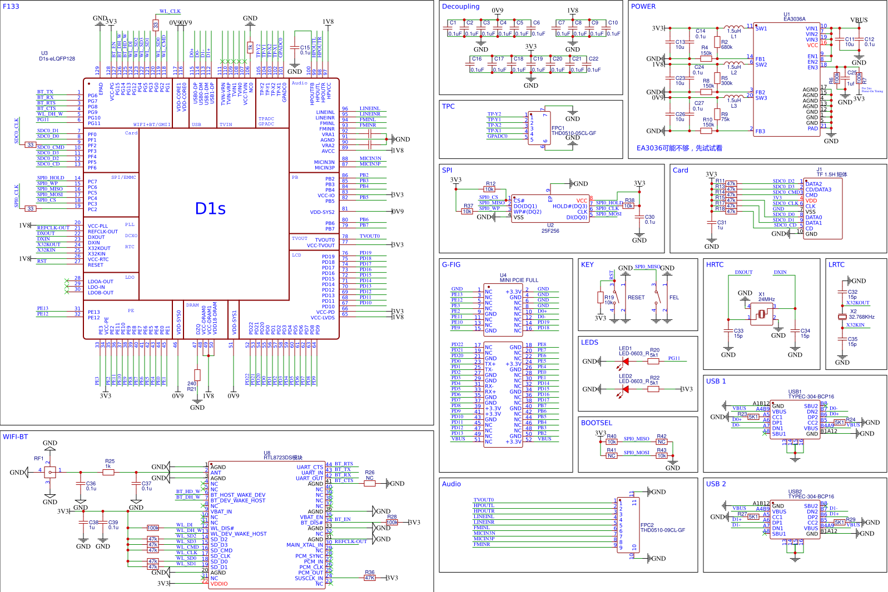
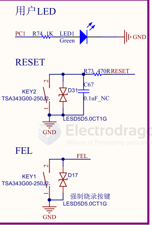
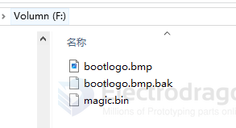

# D1-S-dat

## D1-S-dat 

CPU 

    Alibaba T-Head C906 RISC CPU, 720MHz
    32 KB I-cache + 32 KB D-cache

Allwinner D1s (also known as F133) is based on a RISC-V core, and is a cheaper version of the D1 with the following differences:

- 64 MB of DDR2 memory included in the same package, instead of requiring external memory.
- No Tensilica HiFi4 DSP.
- No HDMI output.
- One less I2S port.

- [[D1s_User Manual_V1.0.pdf]]

https://d1s.docs.aw-ol.com/

- [[sunxi-tools-dat]]

### After Flash

After flashing is complete, you can eject the TF card and insert it into the TF card slot (black font serial number 11) on the front of the development board. At this point, you can:

- Use Dupont wires to connect PE2, PE3, and GND for serial login
- Or use adb shell to connect directly via ADB for login access - [[adb-dat]]

Note: On the D1s, since the TF card and CKlink pins are multiplexed, you need to set the DIP switch SW1 to the numeric direction to support TF card boot

## SCH 

- [[DongshanPI-D1s_SCH-V2.pdf]] 

- [[mini-PCIE-dat]]

| Pins / Signals         | Function    | Notes                              |
| ---------------------- | ----------- | ---------------------------------- |
| PG1 ~ PG6 ~ PG9 ~ PG15 | BT / Wi‑Fi  | Bluetooth and Wi‑Fi signals        |
| PF0–PF6                | SDC0        | SD controller 0                    |
| PC2–PC7                | SPI0        | SPI bus 0                          |
| PE0–PE13               | Camera      | Camera interface pins              |
| PD                     | LCD display | LCD interface signals              |
| audio                  | FPC 9P      | Audio via FPC 9-pin connector      |
| touchpanel             | FPC 5P      | Touchpanel via FPC 5-pin connector |
| SPI0_MOSI              | Button 1    | MOSI repurposed as Button 1        |
| RESET                  | Button 2    | Reset button                       |

misc 

## SD Card 

## ref 

- [[F133-dat]]