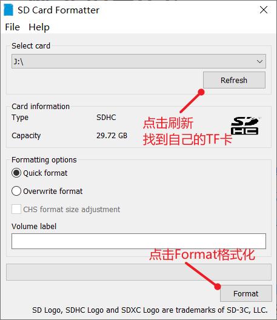
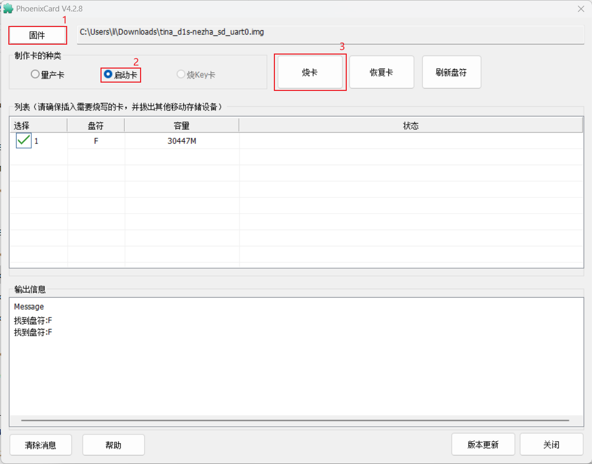

# D1-S-dat

## D1-S-dat 

CPU 

    Alibaba T-Head C906 RISC CPU, 720MHz
    32 KB I-cache + 32 KB D-cache

## flash 

### 操作步骤

1. 将所有文件拷贝到 Ubuntu系统的 ~ 目录下

2. 执行如下解压缩命令，等待解压缩 完成

>   cat tina-d1-h.tar.bz2.* | tar -jxv
> 
1. 解压缩完成后 继续参考 http://riscv64.dongshanpi.com/ 页面 Tina-SDK-V2.0相关资料

### 所有文件MD5校验值

> Ubuntu下输入 md5sum tina-d1-h.tar.bz2.* 查看

e755bae00cd76afc3fb276b4e3fd86ba  tina-d1-h.tar.bz2.00
cb60ecfdb51c624ff3cbd7b24552866f  tina-d1-h.tar.bz2.01
54e56a4cf1cef46ca0a94b85ea1d33a1  tina-d1-h.tar.bz2.02
4988fa08827c0f7af2dc170145e24b26  tina-d1-h.tar.bz2.03
a0463bcf8e73db27b5ecafaac593a919  tina-d1-h.tar.bz2.04
a87382ca16a8c12b3a94f1cad99ce77e  tina-d1-h.tar.bz2.05
5973530baa3b282108351818641c27fd  tina-d1-h.tar.bz2.06
ccd63e1d16534b364a101d2d44416261  tina-d1-h.tar.bz2.07
e0d72713565f4424ea43c07e15a38139  tina-d1-h.tar.bz2.08

### system image and SDK 

- contact and find in our google drive 

### Flash

Allwinner Official Tools
- Allwinner system TF card flashing tool: PhoenixCardv4.2.7.7z.7z
- Allwinner system OTG flashing tool: AllwinnertechPhoeniSuitRelease20201225.zip.zip
Community version flashing tools
- Complete TF card flashing tool: win32diskimager-1.0.0-install.exe
- TF card formatting tool: SDCardFormatterv5_WinEN.zip

### Flashing Allwinner D1 System Image to TF Card (Tutorial)

#### Step 1: Format the TF Card

1. Insert the TF card into a card reader, then connect the reader to your computer's USB port.
2. Use the SD Card Formatter tool to format the TF card. **Backup any important data before formatting.**
3. In the SD Card Formatter interface:
    - Click "Refresh" to detect your TF card.
    - Select your TF card from the list.
    - Click "Format" and confirm by clicking **Yes** in the dialog.
    - Wait for the formatting process to complete.

#### Step 2: Burn the System Image

1. After formatting, open the **PhoenixCard.exe** tool.
2. In PhoenixCard:
    - Find and select your TF card drive letter.
    - Click the "Firmware" button (red box 1) and choose the extracted `tina_d1s-nezha_sd_uart0.img` image file.
    - Click "Startup Card" (red box 2).
    - Click "Burn" (red box 3) and wait for the burning process to finish.

### After Flash

After flashing is complete, you can eject the TF card and insert it into the TF card slot (black font serial number 11) on the front of the development board. At this point, you can:

- Use Dupont wires to connect PE2, PE3, and GND for serial login
- Or use adb shell to connect directly via ADB for login access - [[adb-dat]]

Note: On the D1s, since the TF card and CKlink pins are multiplexed, you need to set the DIP switch SW1 to the numeric direction to support TF card boot

## SCH 

- [[DongshanPI-D1s_SCH-V2.pdf]]

misc 

## ref 

